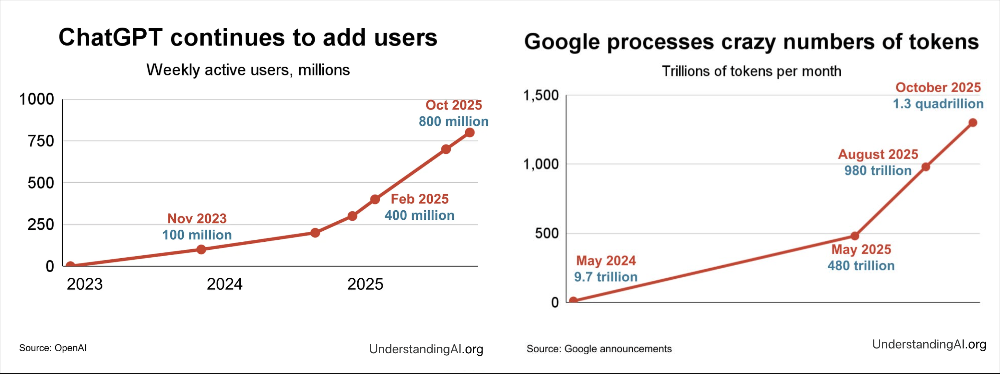
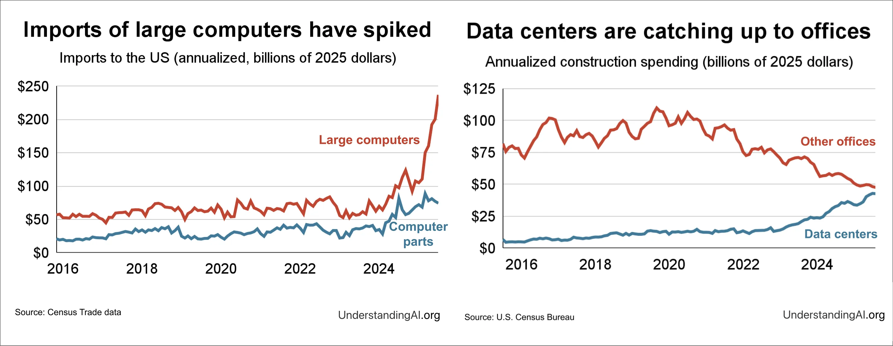
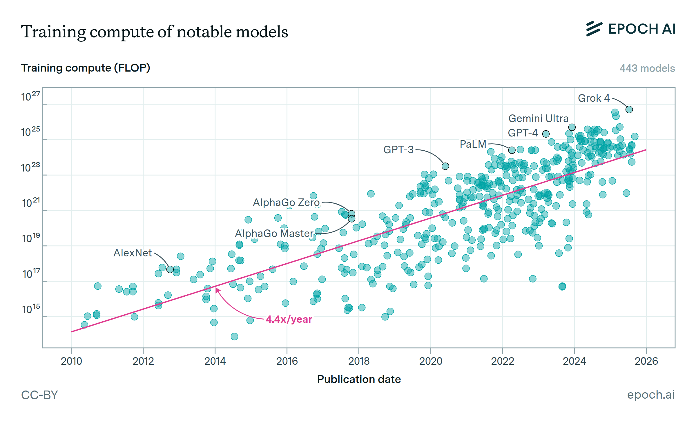
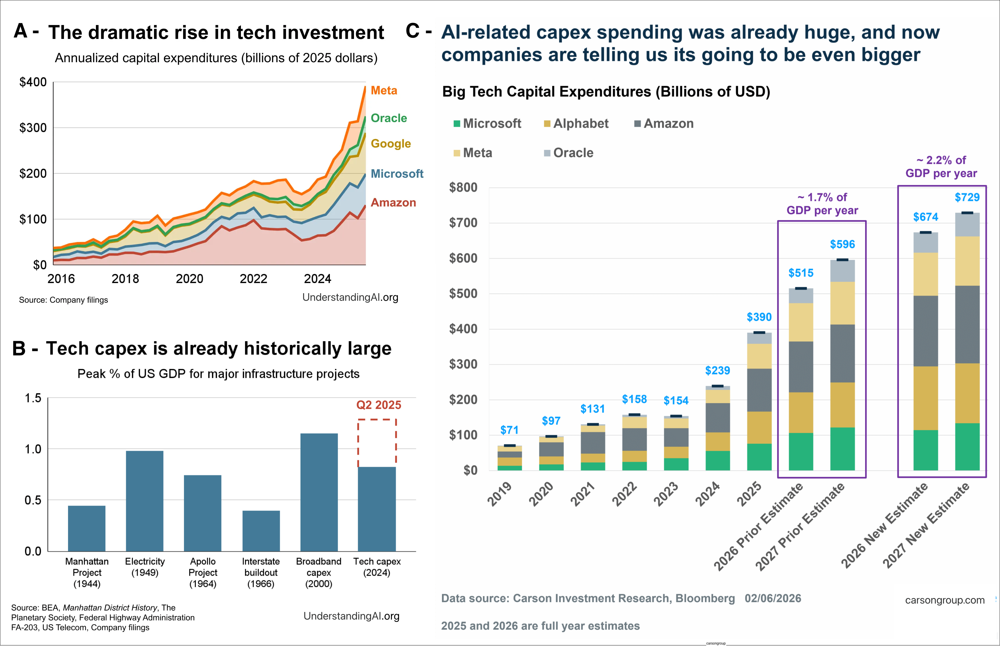
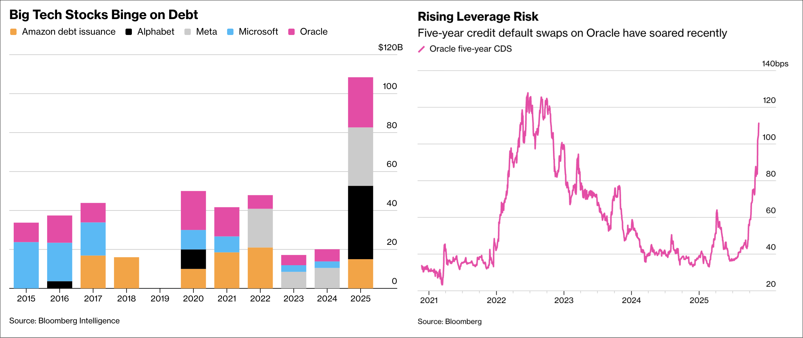
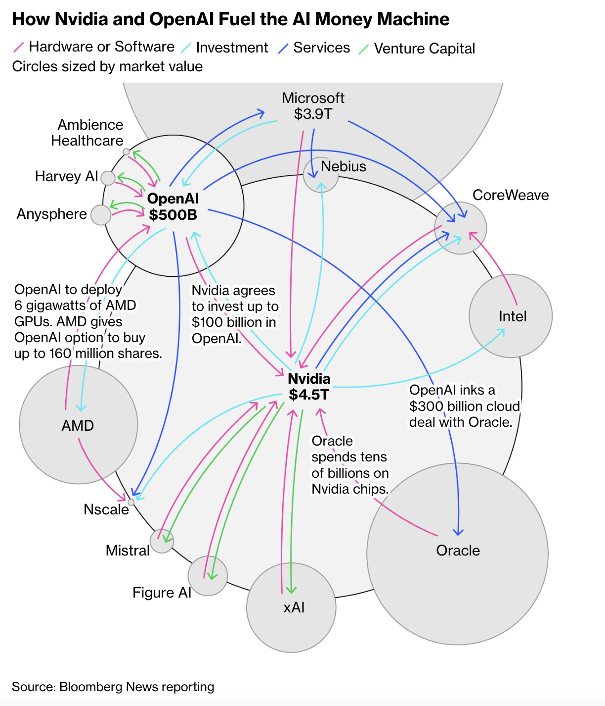
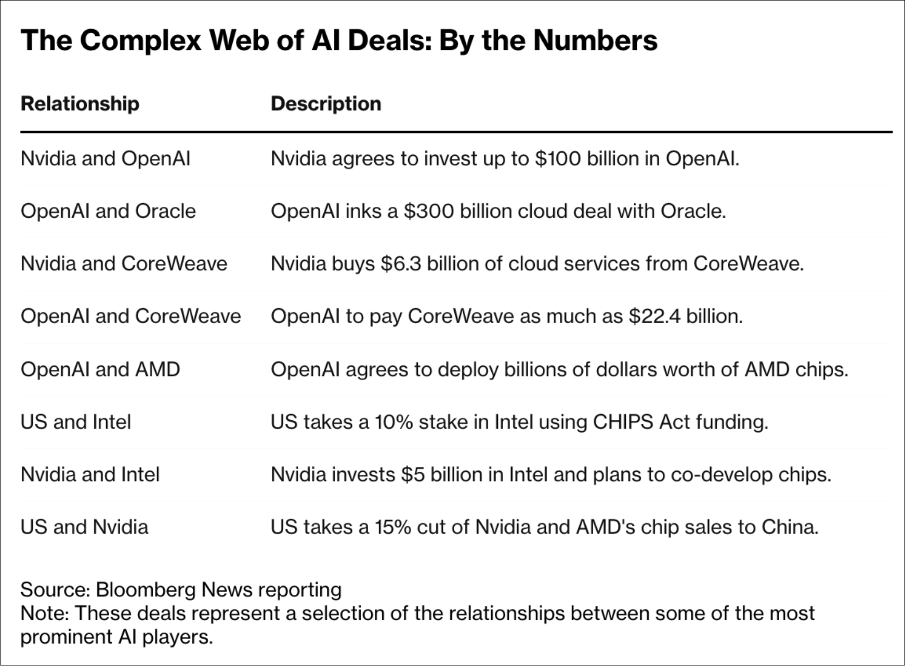
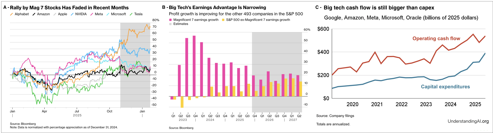

## Introduction

The global financial landscape is currently undergoing a phase of unprecedented mutation, driven by a near-mystical fascination with artificial intelligence (AI). As an absolute symbol of this era, the company Nvidia saw its market capitalization cross the historic threshold of `$`5 trillion, driven by an insatiable demand for its computing chips, which have become the "black gold" of the 21st century. However, behind this stock market triumphalism, unease is growing. While "Tech Giants" such as Amazon.com Inc., Alphabet Inc., Microsoft, Meta, and Oracle intensify their investments at record levels to build AI infrastructure, the question of real profitability becomes central. In 2025, these companies raised a record amount of `$`108 billion in cumulative debt to finance this technological arms race, more than three times the average of the previous nine years. This striking contrast between colossal spending—such as OpenAI's "Stargate" plan estimated at `$`500 billion—and still marginal revenues fuels fears of massive overinvestment and a dangerous disconnection from economic reality, leading us to believe in the risk of a financial bubble.

To understand the scale of the risk, it is necessary to define the nature of a financial bubble. It is characterized by a rapid rise in assets (In this context, an asset refers to a financial security (stocks, bonds) or a tangible good (data centers, computing chips) owned by a company or an investor, and whose value is supposed to generate future profits), disconnected from their economic fundamentals. According to economist Hyman Minsky's model, a bubble follows five stages: displacement, boom, euphoria, profit-taking, and panic. Currently, the sector seems to be in the full euphoria phase, reinforced by atypical financial mechanisms. Notably, we observe the emergence of a "network of circular agreements" where leaders like Nvidia invest heavily in startups (OpenAI, Anthropic, xAI), which then use this capital to buy chips from the same supplier. This system, while artificially supporting revenue growth, creates a fragile interdependence reminiscent of the complex structures of the late 1990s.

Faced with these signals, a fundamental question arises: does the current craze for artificial intelligence rest on tangible and sustainable value creation, or are we witnessing speculation disconnected from reality, doomed to a brutal burst similar to the Internet bubble of the year 2000? While AI has become the top priority for executive boards due to fear of disruption, skepticism is growing regarding the return on investment (ROI). A recent MIT study, conducted by researchers Aditya Challapally, Chris Pease, Ramesh Raskar, and Pradyumna Chari as part of Project NANDA, reveals a questioning paradox: 95% of companies derive no measurable benefit from their investments in generative AI, while a tiny minority (5%) derive gains amounting to millions of dollars. History teaches us that if the infrastructures of a bubble often end up transforming the world, the cost of "creative destruction" can be devastating for investors and the global economy.

To address this problem, our study is structured according to a logical progression aimed at confronting the sector's ambitions with its financial realities. In the first part, we will detail the scale of the phenomenon, analyzing the "AI Money Machine" and the circular financing mechanisms fueling current valuations. The second part will be devoted to warning signals, from the growing gap between investments and revenues to the technological and operational limits encountered by language models.

For the sake of objectivity, we will then nuance our remarks in a third part by exploring why this bubble might differ from previous ones, notably thanks to the insolent financial health of the "Magnificent Seven" (The "Magnificent Seven" are seven American technology giants: Alphabet, Amazon, Apple, Meta, Microsoft, Nvidia, and Tesla, which have dominated stock markets since 2023. These companies, crucial for AI and the cloud, have propelled the performance of the S&P 500, representing nearly 30% of its value) and unprecedented user adoption. Finally, we will conclude with a rigorous historical analysis, applying the Minsky cycle to AI to determine if we are reliving the year 1999, in order to provide a perspective on the future of this technology.

---

## Towards an "AI Money Machine" & Warning Signals of a Speculative Bubble

### The scale of the phenomenon: Towards an "AI Money Machine"

Artificial intelligence has become, in a few years, the central engine of global financial markets. What was recently a niche technological sector is now at the heart of an industrial transformation presented as comparable to electricity or the Internet. Valuations are exploding, investment plans are reaching trillions of dollars, and companies are competing with spectacular announcements.

Yet, behind this euphoria, a growing concern is taking shape: are we witnessing the formation of a speculative bubble of historic proportions? Between massive debt, circular financial arrangements, technological uncertainties, and still unclear profitability, the AI ecosystem seems to be evolving toward a self-sustaining "money machine" whose solidity remains to be proven.

#### Titanic infrastructure needs: The contrast with the pre-AI era

Unlike previous technological waves, generative AI relies on hardware infrastructure of unprecedented intensity. Pre-AI technologies such as cloud, mobile, social networks, and others required significant investments, but were mainly oriented toward software and digital platforms.

AI, on the other hand, relies on a costly triptych: **(1)** ultra-high-performance specialized chips known as GPUs; **(2)** giant data centers consuming massive amounts of electricity; and **(3)** exponential computing capacities to train and operate increasingly large models. The technological ratio is radically different: where the Internet allowed for near-infinite scalability with relatively low marginal costs, AI requires a continuous increase in material investments to maintain competitiveness. Each new generation of models requires more computation, and thus more capital. The recent evolution of artificial intelligence models perfectly illustrates this dynamic of material and energy escalation. Since 2012, the trajectory of models has followed exponential growth in terms of parameters, mobilized computing power, and energy consumption.

In 2012, AlexNet—a convolutional neural network architecture developed for image classification tasks, which gained great notoriety through its performance in the ImageNet Large Scale Visual Recognition Challenge (ILSVRC)—totaled about 60 million parameters and could be trained on a few GPUs for a few days. Ten years later, models like GPT-3 (175 billion parameters) require thousands of specialized GPUs running for several weeks. More recent models, such as GPT-4 or Gemini, although their exact specifications are not public, mobilize infrastructures on the scale of entire data centers, with costs estimated at several hundred million dollars for training. This scaling up does not only concern the number of parameters. It involves: (1) A massive increase in the number of interconnected GPUs (going from dozens to several thousand); (2) increasing energy consumption, reaching several gigawatt-hours for a single training cycle; and (3) increased complexity of distributed systems (high-performance networks, liquid cooling, advanced software orchestration).

Alongside this capacity increase, the tasks made possible have evolved. Below a certain threshold of computational capacity, models excelled mainly in supervised recognition tasks (2012–2016, image classification and object recognition). Beyond a first critical threshold, the increase in the number of parameters and training data allowed for the emergence of coherent generative capacities (2017–2020, machine translation, coherent text generation). A second scaling threshold made more structured behaviors possible: chain-of-thought reasoning, code generation, multimodal integration between 2020–2023. Today, additional computational scaling seems to favor the appearance of agentic behaviors, including planning, prolonged interaction, and partial autonomy. This increase in capacity is not explained solely by internal technological logic. It also responds to an explosion in usage demand.

  
**Image 1: Growth in the number of users and the volume of tokens processed by major AI players. Source: UnderstandingAI.org (2025)**

As illustrated in Figure 1, the adoption of generative AI systems is experiencing an unprecedented acceleration. The number of weekly active users of certain services now exceeds several hundred million, while the volume of tokens processed monthly reaches orders of magnitude in the quadrillions. This exponential growth in demand mechanically imposes a continuous expansion of computing capacities. Unlike previous technological cycles, where infrastructure followed adoption progressively, generative AI imposes a near-instantaneous adaptation of material capacities to avoid system saturation.

This transformation does not remain abstract: it materializes in commercial flows and construction dynamics. Figure 2 shows a marked increase in imports of large computer systems into the United States, alongside an acceleration in construction spending dedicated to data centers. While investments in traditional offices stagnate or decrease, digital infrastructures are undergoing rapid expansion.

**Image 2: Explosion of imports of large computer systems and growth of data center construction spending. Source: U.S. Census Bureau (2025)**

This sectoral shift illustrates a structural rebalancing of physical capital toward assets directly linked to artificial intelligence. AI is therefore not only a software or financial phenomenon: it leads to a tangible reconfiguration of industrial supply chains and real estate investments.

Figure 3 visually illustrates this trajectory of computational escalation. We observe a quasi-exponential growth in the volume of computation mobilized for the training of the most notable models since 2010, with a significant annual multiplicative factor.

  
**Image 3: Evolution of AI model scale: growth of parameters and capabilities**

This trend reflects not just an incremental increase in performance, but a structural transformation of the technological paradigm: each generation of models requires orders of magnitude more in material resources. In other words, the frontier of innovation in AI no longer depends solely on algorithmic advances, but on the ability to mobilize massive computing and energy infrastructures. This growing dependence on physical capital profoundly reconfigures the economy of the sector, favoring actors capable of absorbing these exponential costs. Consequently, the technical evolution of models cannot be dissociated from the evolution of the investments necessary to develop them. The observed rise in computational power is mechanically accompanied by a concentration of capital and an intensification of spending on strategic infrastructure.

#### Unprecedented investments: a historical acceleration

The computational escalation described above mechanically translates into a spectacular intensification of capital investments. The current dynamic is no longer a simple phase of sectoral expansion, but an investment cycle of a magnitude rarely observed in contemporary economic history.

**1. An explosion of CapEx from Big Tech**

Major technology players such as Amazon, Microsoft, Alphabet, Meta, and Oracle committed approximately `$`241 billion in capital expenditures (CapEx) in 2024 (Capital expenditures (CapEx) refer to the funds a company spends to acquire, upgrade, or maintain long-term physical assets such as real estate, buildings, technology, or equipment to increase its operational capacity or improve its efficiency). In the second quarter of 2025 alone, these companies invested `$`97 billion, equivalent to 1.28% of quarterly American GDP. These figures place the current AI boom among the most significant investment cycles of the post-WWII era. For comparison, the investment peaks associated with the Apollo project, the Manhattan Project, or the massive deployment of broadband during the Internet bubble now appear lower in economic intensity.

As illustrated in Figure 4, the current dynamic of technological investments can be analyzed through three complementary dimensions.

Panel **(A)** highlights the spectacular increase in annual investment spending by major technology companies since 2016. The individual trajectories of Meta, Oracle, Google, Microsoft, and Amazon show a particularly marked acceleration starting from 2020–2021, with a clear inflection corresponding to the rise of generative AI models. The slope of the curves suggests not only continuous growth but a recent intensification of the investment pace, reflecting a race to expand infrastructure capacities.

Panel **(B)** places these amounts in historical perspective by comparing them to other major American investment cycles expressed as a percentage of GDP. Current technology sector spending reaches levels comparable to, or even higher than, those observed during structural projects such as the Apollo program, the Manhattan Project, or the massive deployment of broadband infrastructure in the early 2000s. This perspective underscores the exceptional nature of the current phase: it is not a simple sectoral cycle, but an episode of significant macroeconomic intensity.

Panel **(C)** finally projects the aggregated evolution of investment spending by large technology companies through 2026–2027. Revised estimates indicate a potential move from already high levels (about `$`390 billion USD in 2024) to amounts between `$`600 and `$`800 billion USD in the coming years. Relative to US GDP, this spending could represent between 1.7% and 2.2% per year, which would place AI among the most important industrial investment cycles of the post-WWII era.

  
**Image 4: Recent evolution of capital expenditure (CapEx) of large technology companies and historical comparison as a percentage of US GDP. Source: Carson Investment Research, UnderstandingAI (2026)**

It should be noted that not all technology company CapEx is exclusively devoted to artificial intelligence. Nevertheless, public statements by executives indicate that an increasing and now majority share of this spending is oriented toward AI-related capacity expansion, including the construction of data centers, the acquisition of advanced GPUs, and the development of adapted energy infrastructures. The CEO of Amazon stated that AI investment represented "the vast majority" of recent CapEx, while Meta explicitly identifies increasing generative AI capacities as the primary driver of the planned spending increase in 2026.

**2. Increasing reliance on debt and rising leverage risk**

Beyond the absolute volume of investments, a more structural change concerns their mode of financing. The top 5 AI investors collectively raised a record `$`108 billion in debt in 2025, more than three times the annual average observed over the 2016–2024 period. Historically, these companies financed the bulk of their investment spending through their abundant free cash flow. The increased use of debt thus marks a significant strategic inflection. The expansion of AI infrastructure no longer relies exclusively on self-financing, but on an explicit mobilization of bond markets.

Figure 5 highlights this dual dynamic. Panel (A) illustrates the marked increase in bond issuances by large tech companies in 2025. Panel (B) simultaneously shows a significant rise in five-year credit default swap (CDS) spreads (A Credit Default Swap (CDS) is an insurance contract against a company's default risk. As its spread (cost) increases, investors perceive the company as riskier) for Oracle, reflecting a reassessment of risk by the markets.

The case of Oracle is particularly revealing. After issuing `$`18 billion in bonds in September 2025, the company announced additional financing intended to accelerate the construction of data centers. This strategy was accompanied by a deterioration in credit risk perception: CDS reached their highest level in three years, while the stock recorded increased volatility.

  
**Image 5: (A) Debt raised by major technology companies to finance AI; (B) Evolution of Oracle's five-year CDS spreads, a credit risk indicator. Source: Bloomberg (2025)**

This phenomenon reflects an evolution in the risk profile of the technology sector. The AI ecosystem is no longer limited to companies with the strongest balance sheets; it now includes more heavily indebted and interconnected actors. This growing interdependence between chip suppliers, data center operators, hyperscalers, and AI startups introduces a potential for systemic transmission in the event of a slowdown in revenue flows or a lag between investment spending and profitability.

It is, however, necessary to nuance this analysis. According to some estimates, a majority share of investments remains financed by operational cash flows. Current debt does not, therefore, necessarily constitute a signal of immediate fragility. Nevertheless, it increases the sector's sensitivity to a rise in interest rates, a contraction of credit markets, or a slowdown in demand. AI is thus entering a more mature phase of its investment cycle: after the initial expansion financed by cash surpluses, the intensification of the infrastructure race is now accompanied by increased use of financial leverage, which reconfigures the sector's risk-return profile.

#### Circular agreements: towards a systemic financialization of AI infrastructure

Beyond the scale of the amounts invested, the uniqueness of the current cycle lies in the very structure of the financial flows. An increasing share of transactions within the AI ecosystem adopts a configuration known as "circular financing," in which the capital injected by one actor partially returns to them in the form of orders, infrastructure contracts, or equipment purchases.

Figure 6 illustrates this dynamic. Nvidia invests up to `$`100 billion in OpenAI to support the construction of massive data centers. OpenAI, in return, commits to equipping these infrastructures with millions of Nvidia chips. Simultaneously, OpenAI enters into a `$`300 billion agreement with Oracle for the deployment of data centers, which are themselves largely powered by Nvidia processors.

 
**Image 6: Network of financial and industrial interconnections between Nvidia, OpenAI, and their partners. Circles are proportional to market capitalization. Source: Bloomberg News reporting (2025)**

This pattern creates a financial feedback loop: the investor becomes the supplier, the beneficiary becomes the customer, and flows circulate within a restricted network of dominant actors. Massive contractual commitments that can cumulatively exceed one trillion dollars reinforce the interdependence between semiconductor suppliers, cloud hyperscalers, and model developers.

Figure 7 highlights the quantitative scale of these transactions: capital investments, multi-year cloud contracts, cross-shareholdings, and massive GPU purchases. These agreements are not simple traditional commercial partnerships; they form a dense contractual mesh that links the financial trajectories of multiple companies.

  
**Image 7: Selection of strategic agreements and associated amounts within the AI ecosystem. Source: Bloomberg News reporting (2025)**

This structure has several macro-financial implications, such as the compression of expansion timelines; the artificial securing of revenues (a portion of sales may come from capital reinjected within the same network); and increased interdependence.

It is, however, necessary to distinguish financial circularity from accounting fraud. Circular financing is neither illegal nor unprecedented; similar mechanisms were observed during the telecommunications boom in the late 1990s. The major difference lies in the current scale and the concentration of flows within a small number of systemic actors.

The central question is therefore not the legality of these agreements, but their ability to reflect durable organic demand rather than a mechanism for self-fueling the investment cycle. When customers are simultaneously investors, suppliers, and strategic partners, the distinction between real growth and financed growth becomes more complex to establish (a point of suspicion for the AI bubble).

Thus, the AI ecosystem is evolving toward a hybrid model blending technological innovation, financial engineering, and vertical integration. This configuration can accelerate the development of critical infrastructure, but it also increases the sector's sensitivity to any valuation correction, credit contraction, or slowdown in final demand.

### What about the profitability of the AI sector?

After the explosion of investments, the intensification of reliance on debt, and the multiplication of circular agreements, the central question becomes that of effective return: do the massive expenditures engaged in AI translate into proportional profitability?

It is first appropriate to distinguish two levels of analysis: the profitability of companies as a whole and the specific profitability of AI investments. While the first is observable through published financial results, the second remains largely partial and indirect.

#### 1. Highly profitable companies, but under surveillance

The "tech giants"—Alphabet, Amazon, Apple, Meta, Microsoft, Nvidia, and Tesla—continue to display high levels of profitability. Recent quarterly results indicate an aggregate earnings growth of about 27%, higher than initial expectations and clearly above the S&P 500 average (The S&P 500 is a stock index grouping 500 of the largest listed companies in the United States. It is often used as a benchmark for the overall performance of the US market). Operating margins remain solid, and cash flows remain positive for the majority of players.

However, the market has recently begun a phase of reassessment. As illustrated in Figure 8, the stock market rally (In finance, a stock market rally refers to: A period of strong, rapid, and sustained rise in stock prices. It is thus a phase of optimism where markets rise sharply over a relatively short period) of major tech stocks has eased since the end of 2025, reflecting an increased requirement for justification of the return on invested capital. Simultaneously, the earnings growth gap between tech giants and the rest of the S&P 500 tends to narrow.

  
**Image 8: (A) Recent cooling of the "Magnificent Seven" stock rally; (B) Progressive reduction of the earnings growth gap between tech giants and the rest of the S&P 500; (C) Operational cash flows of large tech companies remaining higher than their capital expenditures (CapEx). Source: Bloomberg (2026)**

This dual dynamic suggests a regime change: investors no longer value only the technological promise but demand tangible proof of sustainable profitability.

#### 2. Partially observable AI profitability

While the overall profitability of large technology companies is measurable through their consolidated financial statements, the specific profitability of artificial intelligence investments remains more complex to isolate. Groups publish detailed data relating to the growth of their cloud revenues (Microsoft Azure recording a progression between 36 and 39%, Google Cloud around 34%, and Amazon Web Services also showing acceleration) as well as their investment spending amounts, consolidated operating margins, and free cash flows. However, these aggregate indicators do not allow for the precise identification of the return on projects strictly related to generative AI. Companies do not communicate explicit metrics regarding the return on investment of AI models, the specific profitability of dedicated data centers, or the payback period for capital committed to computational infrastructure. The assessment of AI's economic performance must thus rely on indirect indicators: the ability to maintain stable margins despite the rapid increase in investment spending, the preservation of a positive free cash flow, and the effective progression of revenues associated with cloud services and AI applications. In the current state of the cycle, profitability exists at the consolidated level, but the exact translation of massive AI investments into autonomous and measurable returns remains only partially observable.

#### 3. A phase of discipline rather than collapse

Recent market reactions indicate a transition from a phase of unconditional enthusiasm to a phase of financial discipline. Companies announcing a substantial increase in spending without clear visibility on immediate returns are penalized, while those demonstrating an effective acceleration of AI revenues are rewarded.

It is not a contraction of profits but a reassessment of the pace and sustainability of their growth. The dominant question is no longer: "Are companies profitable?" but rather: "Is the current level of investment proportionate to the incremental growth in profits?"

#### Summary

At this stage of the cycle:

* Large technology companies remain highly profitable.
* Cloud and AI-related revenues effectively contribute to growth.
* The performance gap with the rest of the market is narrowing.
* Investors now demand an explicit demonstration of the return on invested capital.

The current profitability of the sector confirms neither an imminent collapse nor unlimited expansion. It rather reflects a phase of progressive maturity: infrastructure is deployed, profits exist, but full validation of the return on investment for massive AI spending remains only partially observable.

The evaluation of a possible "bubble" will thus depend less on present profits than on companies' ability to convert the current capital intensity into sustainable and autonomous cash flows in the years to come.

### Warning signals of a speculative bubble

Despite the enthusiasm, fundamental indicators are beginning to diverge critically from record stock valuations, reminiscent of the early stages of the 2000 crash.

#### The ROI gap: an implicit requirement of 2,000 billion

The true point of tension between Silicon Valley and financial markets no longer lies in the ability to raise capital, but in the ability to generate a return proportional to the amounts committed. According to several estimates, notably those from Bain & Company, the current level of AI investment spending would imply that the sector generates about `$`2 trillion in annual revenue by 2030 to fully justify the observed CapEx trajectory. However, current projections peak around `$`1.2 trillion, revealing a potential gap of nearly `$`800 billion between anticipated revenues and the revenues needed to support current valuations and investments.

This gap does not necessarily mean immediate overvaluation, but it underscores the magnitude of the implicit assumptions built into market prices. The question is therefore not simply that of present profitability, but that of the incremental growth required to absorb the sector's capital intensity.

Furthermore, several academic studies nuance the immediate economic impact of AI. Recent work indicates that a large majority of companies do not yet observe tangible financial gains in the short term. Other researchers highlight a risk of qualitative degradation of work, where potential productivity gains are partially neutralized by errors or less operational rigor. This dissociation between technological promise and observable profitability fuels the growing skepticism of institutional investors.

#### Technological limits and structural constraints

Beyond the financial debate, AI is now hitting physical, economic, and theoretical constraints. The logic of "scaling laws"—according to which the joint increase in data, parameters, and computing power would mechanically lead to a proportional improvement in performance—is showing diminishing returns. Successive generations of models show more marginal progress relative to the explosion of training costs.

At the same time, energy constraints are becoming a determining factor. The electrical consumption of data centers dedicated to AI is progressing at a steady pace, posing problems for network infrastructure and energy availability. Projects to integrate nuclear solutions or dedicated capacities testify to this tension. AI is no longer just an algorithmic challenge; it is becoming a large-scale industrial and energy engineering problem.

To these constraints is added a financial hypothesis rarely discussed publicly: the real lifespan of GPUs. Current financial models generally assume a depreciation period of five to six years. However, in an environment where Nvidia introduces a new generation of chips every year, the risk of accelerated obsolescence is non-negligible. Overestimating the economic useful life of equipment could artificially smooth costs and inflate short-term profits. If this hypothesis proved too optimistic, massive asset write-downs could occur, affecting profitability, solvency, and the collateral value of debt-financed infrastructure simultaneously.

#### Market shocks and the fragility of technological premiums

The DeepSeek episode illustrated the extreme sensitivity of valuations to dominant technological assumptions. The demonstration that a competitive model could be trained for a cost significantly lower than the amounts announced by established players provoked a brutal reassessment of monopolistic rent expectations (Monopolistic rent refers to the excessive profits a company can obtain when it has significant market power, allowing it to set prices above the competitive level). In a single session, nearly `$`1 trillion in capitalization evaporated from the sector.

This event did not invalidate AI's potential, but it revealed the fragility of the technological premium integrated into valuations. When the perceived scarcity of competitive advantage decreases, justifying high multiples becomes harder to sustain.

Meanwhile, the increased use of debt to finance infrastructure expansion strengthens the sector's sensitivity to credit conditions. If expected revenue flows materialize more slowly than planned, leverage could amplify market adjustments.

#### Summary of expertise: The transition to the "Profit-taking" phase

Analysis from public figures confirms this shift. While Sam Altman (OpenAI) tries to reassure by promising imminent "Superintelligence" to justify funds, more cautious voices like David Einhorn or Jeff Bezos are now openly comparing the situation to the biotechnology bubble of the 90s or the fiber optic bubble in 2000. In the Minsky cycle, we seem to be leaving the euphoria phase to enter "Profit-taking," where institutional investors begin to withdraw their capital due to the lack of proof of short-term profitability.

---

## 1999 Revisited? AI Between Speculative Euphoria and Solid Fundamentals

### Why this "bubble" could be different

The analysis of overheating signals should not be enough to conclude an imminent collapse comparable to that of the Internet bubble. While some dynamics recall past speculative excesses, several structural elements profoundly distinguish the current cycle. Historical comparison thus requires a nuanced approach, taking into account both observed fragilities and the sector's intrinsic strengths.

#### Financial solidity of technological leaders

Unlike the Internet bubble of the late 1990s, dominated by young, unprofitable companies heavily dependent on capital markets, the current cycle rests on actors with exceptionally solid balance sheets. The "tech giants" generate tens of billions of dollars in annual cash flows and display robust operating margins.

Microsoft, Alphabet, and Meta have considerable cash reserves and historically profitable activities (software, digital advertising, cloud computing) capable of absorbing intensive investment phases. Nvidia, the main GPU supplier, benefits from some of the highest gross margins in the semiconductor sector.

Thus, unlike the startups of 1999 that depended exclusively on outside financing to survive, current leaders can self-finance a substantial portion of their infrastructure spending. This absorption capacity reduces the risk of an immediate systemic collapse.

#### Massive adoption and tangible uses

A second differentiating factor lies in the speed and scale of generative AI adoption. ChatGPT is among the fastest-growing products in digital history, reaching several hundred million weekly active users in record time. The volumes of processed queries amount to trillions of tokens monthly.

Beyond the hype, AI is progressively integrated into concrete value chains: administrative task automation, software development assistance, advertising optimization, information search, customer support, and analytical tools. Cloud services record steady demand linked to AI workloads, reflecting effective rather than purely speculative use.

Unlike many "dot-com" companies that relied essentially on traffic projections or future market share, the current ecosystem already generates substantial revenues from users and corporate clients.

#### The strategic risk of inaction: a defensive competitive logic

The intensity of investments is not explained solely by technological optimism, but also by defensive logic. For many executives, the risk of under-investment is perceived as higher than that of excess spending.

In an environment where AI is likely to redefine business models—online search, advertising, software productivity, e-commerce, etc.—failing to invest enough could lead to an irreversible loss of competitive position. This dynamic generates a "strategic FOMO" (fear of missing out) phenomenon, where prudence can be interpreted as vulnerability.

Thus, the acceleration of CapEx does not reflect only speculative euphoria, but also a race to secure dominant positions in a potentially transformative technological paradigm.

### Historical Analysis: Are we in 1999?

To evaluate the nature of the current cycle, it is useful to apply Hyman Minsky's theoretical framework, which describes five typical phases of speculative cycles: displacement, boom, euphoria, profit-taking, and panic.

#### Application of the Minsky cycle to the AI cycle

"Displacement" corresponds to the emergence of a major innovation, here generative AI. The "boom" manifested through the explosion of investments and the multiplication of strategic announcements. "Euphoria" was characterized by record valuations and rapid expansion of financial leverage.

Recent signals of investor discipline could indicate a progressive entry into a "profit-taking" phase, where capital becomes more selective and profitability requirements intensify. However, unlike the final "panic" phase, aggregate profitability indicators remain solid and cash flows remain positive for the main players.

#### Parallel with the Internet bubble: comparative quantitative analysis

Comparison between the current artificial intelligence cycle and the Internet bubble of the late 1990s requires a rigorous examination of financial indicators and capital flows. While some dynamics recall past exuberance—capitalization concentration, transformational narrative, massive influx of financing, etc.—the data reveal both structural convergences and divergences.

**Valuation indicators.**

At the peak of the Internet bubble, the forward Price/Earnings (Forward P/E) ratio of the Nasdaq-100 reached approximately 60× in March 2000, a historically extreme level. By comparison, the equivalent multiple is around 26× in 2023–2024. Furthermore, only a minority of listed technology companies were profitable in 2000 (about 14%). Today, major AI players (Microsoft, Alphabet, Nvidia, Apple) remain largely profitable. The following table summarizes key valuation indicators:

| **Indicator** | **Internet Bubble (1999–2000)** | **AI Boom (2023–2025)** | **Analysis** |
| :--- | :--- | :--- | :--- |
| Forward P/E Nasdaq-100 | 60.1× (March 2000) | 26.4× (Nov. 2023) | Multiples significantly more extreme in 2000; current levels high but moderate. |
| Index Level | Nasdaq 5,048 (March 2000) | Nasdaq ~16,000; S&P 500 ~4,800 | Historical peaks in both periods, but different macroeconomic context. |
| Leader Capitalization | Cisco ~`$`370B | Nvidia ~`$`3.3T; Apple ~`$`3.5T | Capitalizations much higher today, supported by real profits and high margins. |
| Median Price/Sales Ratio | Often >50× | High, generally <50× (leaders) | Generalized excesses in 2000; current tensions more concentrated. |
| Share of Profitable Companies | ~14% | Majority of leaders profitable | Major structural difference: profitability largely absent in 2000. |
| Venture Capital Concentration | Strong but sectorally dispersed | 53–58% of global VC directed toward AI | Unprecedented concentration toward a single segment, potential signal of sectoral overheating. |
| Valuation per Employee | Not relevant | `$`400M–`$`1.2B (some AI startups) | Atypical indicator with no historical precedent, revealing high expectations. |

*Table 1: Comparison of key financial indicators between the Internet bubble and the current AI cycle.*

These data suggest that, on traditional aggregate multiples, the current situation appears less extreme than in 2000. However, some unprecedented metrics, notably the valuation per employee in certain AI startups, reflect particularly ambitious expectations.

**Investment flows and capital concentration.**

Analysis of financial flows also reveals similarities and differences. In 2000, American venture capital reached about `$`112 billion. In 2024–2025, annual invested amounts exceed `$`200 billion, with a majority share directed toward artificial intelligence.

| **Indicator** | **Internet Bubble (1999–2000)** | **AI Boom (2023–2025)** | **Analysis** |
| :--- | :--- | :--- | :--- |
| Annual VC (USA) | ~`$`112B (2000) | ~`$`209B (2024) | High intensity in both periods; absolute level higher today. |
| Sectoral VC Share | Strong but sectorally dispersed | ~58% of global VC directed toward AI | Unprecedented concentration toward a single segment, potential signal of overheating. |
| Number of Tech IPOs | ~527 (1999) | Few IPOs; massive private raises | Public speculation in 1999; mainly private speculation today. |
| Average Time to Profitability | Often nonexistent (fast bankruptcies) | Ambitious projections; uncertain profitability | Limited visibility on the real economic trajectory of AI startups. |
| Excessive Acquisitions | Cisco–Arrow ~`$`11B (2000) | No comparable wave observed | Fewer visible M&A excesses at this stage of the cycle. |
| Investor Positioning | Dominant euphoria | 54% of managers mention a bubble | Increased risk awareness in the current cycle. |

*Table 2: Comparison of investment flows and market structure between the Internet bubble and the current AI cycle.*

(IPO stands for Initial Public Offering. It is the moment when a private company sells its shares to the public for the first time and becomes listed on the stock exchange).

The current concentration of venture capital toward AI is unprecedented. Where the Internet bubble translated into a proliferation of public IPOs, the current cycle favors massive private fundraisings, sometimes exceeding `$`10 or `$`20 billion, concentrated on a restricted number of actors.

**Comparative case studies.**

The example of Pets.com illustrates the extreme irrationality of the Internet bubble: high valuation despite a total absence of profitability and a structurally deficient business model. Conversely, Nvidia today shows substantial profits and margins exceeding 50%, which constitutes a major difference with the technological leaders of 2000.

However, some AI startups present configurations closer to past excesses. OpenAI or Databricks have reached valuations of tens or even hundreds of billions of dollars with still modest revenues, relying largely on future expectations. This dynamic reminds us that while the fundamentals of established leaders are solid, some segments of the ecosystem present speculative characteristics comparable to those observed in the late 1990s.

**Comparative synthesis.**

Quantitative analysis thus reveals a hybrid configuration. Aggregate multiples and the profitability of leaders differ sharply from the situation in 2000, suggesting a more robust economic base. On the other hand, the extreme concentration of capital flows, some high private valuations, and atypical metrics constitute sectoral overheating signals.

Thus, the question is not one of a total absence of economic value, but one of a possible over-anticipation of the future trajectory of that value. The current cycle combines real fundamentals with ambitious expectations, distinguishing it from a purely speculative bubble while not excluding targeted corrections.

**Summary**

The hypothesis of a speculative bubble cannot be ruled out, but it cannot be affirmed without nuance. The sector combines characteristics typical of cycles of financial exuberance with stronger economic fundamentals than those observed during past crises.

The current dynamic seems less about an imminent collapse than a transition phase toward progressive maturity, where profitability must gradually catch up with the committed capital intensity.

The future trajectory will depend less on the continuation of investments than on their ability to generate autonomous and sustainable cash flows on a macroeconomic scale, as well as the ability of AI models to materialize their promises into measurable productivity gains, qualified job creation, and durable structural transformations.

---

## CONCLUSION

The analysis developed throughout this study leads to a nuanced but structured conclusion. The current artificial intelligence ecosystem undeniably presents several characteristics typical of a speculative euphoria phase: high valuations, acceleration of financial leverage, unprecedented capital intensity, and dependence on ambitious growth hypotheses. As such, the sector seems to fall within an advanced phase of the cycle described by Hyman Minsky, where collective optimism tends to precede an increased requirement for financial discipline.

However, qualifying the current dynamic as a "bubble" does not mean that the underlying technology is devoid of value or doomed to collapse. Economic history shows that technological bubbles are often accompanied by a double movement: an overestimation of short-term expectations, followed by a lasting structural transformation in the long term. The Internet of the late 1990s destroyed thousands of companies, but it simultaneously laid the foundations of the contemporary digital economy.

The current situation seems to follow a comparable logic. Many companies engaged in the AI infrastructure race might not survive a financial normalization phase, particularly those excessively relying on leverage or optimistic assumptions regarding the lifespan of technological assets. On the other hand, actors with solid balance sheets, durable competitive advantages, and a real user base could emerge stronger from this adjustment phase.

The real stake thus goes beyond the simple financial question. While market discipline constitutes a determining factor in the short and medium term, the fundamental challenge could be societal and productive. Will generative AI really transform global economic productivity, or will it mainly produce marginal gains offset by a qualitative degradation of work and organizational complexification? The question of diminishing returns from scaling laws and energy sustainability suggests that the real impact will depend less on computational power than on the ability of companies and institutions to integrate these tools effectively.

Ultimately, artificial intelligence seems to be neither a simple speculative mirage nor an automatic guarantee of prosperity. It constitutes a major technological bet, supported by colossal financial flows and dominant actors capable of absorbing part of the risk. As with past great waves of innovation, the current phase could combine creative destruction and industrial consolidation. Many companies will likely fail. The survivors, however, could lastingly redefine productive structures and the balance of global markets.

The central question is therefore not whether a correction will take place, but whether the infrastructure built today will be capable of generating, beyond speculation, sustainable economic and societal value.

---

## SOURCES

* **Le Monde.** (2025, October). *5 000 milliards de dollars de valorisation : Nvidia bat tous les records pour une société cotée*. Le Monde Économie.
* **Fiegerman, S., & Reinicke, C.** (2025, November). *Big Tech’s Debt Binge Raises Risk in Race to Create an AI World*. Bloomberg News.
* **OpenAI.** (2025, January). *Announcing the Stargate Project*.
* **Boursier.com.** (2025, September). *L'accord entre Nvidia et OpenAI soulève des inquiétudes sur des investissements circulaires dans l'IA*.
* **Bloomberg Intelligence.** (2025, October). *Disruption Risk Puts AI at the Top of C-Suite Agenda, According to Bloomberg Intelligence Survey*.
* **Krizhevsky, A., Sutskever, I., & Hinton, G. E.** (2017). *ImageNet classification with deep convolutional neural networks*. Commun. ACM, 60(6), 84–90.
* **Epoch AI.** (2025, July). *Data on AI Models*.
* **Fiegerman, S., & Reinicke, C.** (2025, November). *Why AI Bubble Concerns Loom as OpenAI, Microsoft, Meta Ramp Up Spending*. Bloomberg News.
* **Williams, K.** (2025, October). *16 charts that explain the AI boom: It’s one of the largest investment booms in the post-war era*. Understanding AI.
* **Authers, J.** (2026, January). *The AI Bubble Could Pop With Higher Tariffs and Fewer Workers*. Bloomberg Opinion.
* **Rinaldi, O., & Egkolfopoulou, C.** (2026, January). *BlackRock’s Fink Not Worried About a Bubble Forming in AI*. Bloomberg News.
* **Bloomberg News.** (2025, December). *Bubbles Everywhere: From AI to Luxury Watches*. Bloomberg Businessweek.
* **Intuition Labs.** (2026, January). *AI Bubble vs. Dot-com Comparison: Historical Patterns and Modern Divergences*.
* **Varghese, S.** (2026, February). *Big Tech Capex Plans Are Ballooning – Is That Good or Bad?*. Carson Group.
* **Sam, C., Dottle, R., Ghosh, A., & Kim, K.** (2026, January). *A Guide to the Circular Deals Underpinning the AI Boom*. Bloomberg Technology.
* **Forgash, E., & Ghosh, A.** (2025, October). *OpenAI, Nvidia Fuel `$`1 Trillion AI Market With Web of Circular Deals*. Bloomberg News - The Big Take.
* **Wittenstein, J., & Vlastelica, R.** (2026, January). *Big Tech Earnings Land With 2026’s AI Winners Still in Question*. Bloomberg Markets.
* **Wu, D., Mochizuki, T., & Lee, Y.** (2026, February). *Rampant AI Demand for Memory Is Fueling a Growing Chip Crisis*. Bloomberg Technology.
* **Alba, D., & Metz, R.** (2025, November). *The AI Industry Is Built on a Big, Unproven Assumption*. Bloomberg Technology.