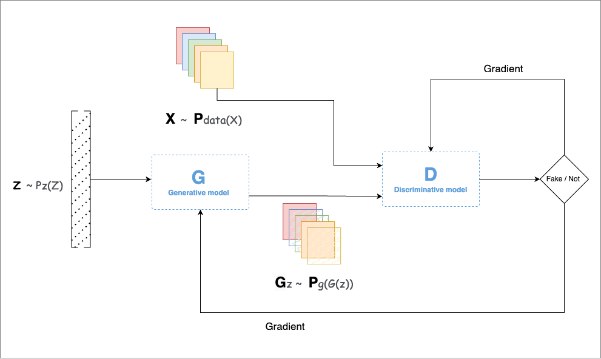

## Introduction

Do you recognize the image placeholder in this article? The image, signed with mathematical formulas, is a portion of Image 1: the **Portrait of Edmond Belamy**. This artwork, created with an AI algorithm known as a <a href="#reference-2" class="">GAN (Generative Adversarial Network)</a>, was crafted by the Paris-based collective Obvious, which includes members Hugo Caselles-Dupre, Pierre Fautrel, and Gauthier Vernier. The portrait was auctioned by Christie’s in New York from Oct 23 to 25, with an estimated sale price of \$7,000 to \$10,000<a href="#reference-1" class="cst">[1]</a>. The mathematical code signed within the image is part of the GAN’s **loss function**, contributing to its creation.

<!-- 

  

    
  

  

    
  

  

    
  

 -->

  
**Image 1: Portrait of Edmond Belamy (The overall collection is available <a href="https://obvious-art.com/la-famille-belamy/" target="_blank">here</a>)**

Generative Adversarial Networks (GANs) are a groundbreaking AI technique developed by Ian Goodfellow and his team in 2014<a href="#reference-2" class="cst">[2]</a>. The name "Belamy" in the portrait title also hints at "Bel ami," which translates from French as "Good friend," a nod to GAN creator Mr. Goodfellow.

But how did this technique, which seemingly gives imagination to computers, come to be? Let’s take a look.

## StoryTime

In 2014, while celebrating a friend’s graduation at Les 3 Brasseurs in Montreal, Ian Goodfellow was asked for help on a challenging project: creating computer-generated photos. Traditional neural networks, used as generative models, often produced blurry or incomplete images. Goodfellow initially doubted his friends' approach, as it required extensive computation. However, over a beer, he conceived a different idea: pitting two neural networks against each other. 

Later that night, he coded his idea and tested it. To his surprise, it worked on the first try. This innovation became known as a GAN, a breakthrough that opened new possibilities in artificial intelligence, particularly in fields like image synthesis, video generation, text-to-image creation, and data augmentation.

## How GANs Work

### Intuition behind

The main idea behind GANs is to create a system where two networks work together to generate realistic data. This process involves a **latent space**, where the input data (whether images, text, music, or other types) is transformed into vectors that capture its core features in a simplified form. This latent space allows GANs to generate realistic variations of the data they are trained on, acting as a kind of “universal translator” of patterns and structures across data types.

A GAN has two key components: the **Generator (G)** and the **Discriminator (D)**. 

1. **Generator (G)**: The generator learns to create new samples that resemble real data. Starting from random noise, it gradually learns to produce outputs that are difficult to distinguish from actual data. For example, if the data is made up of images of 18th-century portraits, the generator will try to make images that look similar to these portraits.

2. **Discriminator (D)**: The discriminator’s role is to differentiate between real and fake samples. It learns to recognize patterns in real data and to detect when something has been artificially generated by the generator. Each time the discriminator identifies a fake, it sends feedback to the generator, which then tries to improve its creations.

This interaction between the two networks forms a competitive learning loop:

- The generator tweaks its output to make it harder for the discriminator to spot as fake.
- The discriminator, in turn, becomes more adept at identifying fakes, leading to more refined feedback for the generator.

>Example:

Imagine the discriminator (D) is an image classifier trained to recognize images of animals. The generator (G) tries to create images that resemble these animals but adds small variations to make the images slightly different, introducing features that don’t quite match real animals. For example, the generator might create a cat with an extra eye. The discriminator would likely recognize this image as fake, prompting the generator to adjust its approach.

> Training cycle

During training, both networks are presented with a mix of real images (from the training data) and fake images (created by the generator). The generator’s goal is to "fool" the discriminator into thinking its outputs are real, while the discriminator's goal is to detect which images are fake. The feedback loop continues, with each network improving over time until the generator can produce data so realistic that the discriminator struggles to tell it apart from the original data.

This competitive process ultimately leads to a balance, where the generator creates highly convincing samples and the discriminator’s ability to spot fakes is optimized.

<!-- ----

The intuition is to develop and algorithms involved take input data and recast it as vectors in something called Latent Space. Here, all data is of a similar nature, whether it be images, text, music, or any other material. Because of this zero-level of interpretation, the model can be a kind of ‘Universal Translator’, and cross boundaries that humans could not. These processes will then inspire and inform artists in entirely new ways, allowing them to create completely original artworks.

According  <a href="#reference-2" class="cst">[2]</a> the idea of a GAN is that you train a network (G) to look for patterns in a specific dataset (like pictures of 18th century portraits or .. or ...) and get it to generate copies. Then, a second network called a discriminator (D) judges its work, and if it can spot the difference between the originals and the new sample, it sends it back. The first network then tweaks its data and tries to sneak it past the discriminator again. It repeats this until the generator network is creating passable fakes. 

 

The first neural net is called the Discriminator (D) and is the net that has to undergo training. D is the classifier that will do the heavy lifting during the normal operation once the training is complete. The second network is called the Generator (G) and is tasked to generate random samples that resemble real samples with a twist rendering them as fake samples.

As an example, consider an image classifier (D) designed to identify a series of images depicting various animals or birds or things . Now consider an adversary (G) with the mission to fool (D) using carefully crafted images that look almost right but not quite. This is done by picking a legitimate sample randomly from training set (latent space) and synthesiging a new image by randomly altering its features (by adding random noise). As an example, G can fetch the image of a cat and can add an extra eye to the image converting it to a false sample. The result is an image very similar to a normal cat with the exception of the number of eye

 

During training, D is presented with a random mix of legitimate images from training data as well as fake images generated by G. Its task is to identify correct and fake inputs. Based on the outcome, both machines try to fine-tune their parameters and become better in what they do. If D makes the right prediction, G updates its parameters in order to generate better fake samples to fool D. If D’s prediction is incorrect, it tries to learn from its mistake to avoid similar mistakes in the future. The reward for net D is the number of right predictions and the reward for G is the number D’s errors. This process continues until an equilibrium is established and D’s training is optimized. -->

### Mathematical perspective
pass

## Applications of GANs

GANs have numerous applications across different domains. Below, we explore some of the prominent use cases of GANs and how they are implemented.

#### 1. **Image Synthesis and Modification**

GANs are widely used for generating high-quality, realistic images, often indistinguishable from actual photos. This application can be broken down into several sub-use cases:
   - **Image Generation**: GANs can create new, realistic images from scratch. For instance, platforms like "This Person Does Not Exist" generate faces that look real but do not belong to any actual person.
   - **Image Super-Resolution**: GANs can increase the resolution of low-quality images, a technique often used to improve old or pixelated images.
   - **Image Inpainting**: GANs can fill in missing parts of an image, commonly used for restoration in media where parts of the data are corrupted or lost.

#### 2. **Text-to-Image Synthesis**

One of the fascinating applications of GANs is the ability to generate images based on textual descriptions. In this process, a GAN model translates a text description (e.g., "a sunset over a mountain") into a corresponding image. This application holds significant promise for fields like graphic design, creative content generation, and digital art creation, allowing artists and content creators to generate visuals directly from their ideas.

#### 3. **Deepfake Generation**

GANs can create highly realistic videos known as "deepfakes," where the faces or voices of individuals are manipulated to create lifelike, synthetic portrayals. While deepfakes are used creatively in fields like entertainment, they also raise ethical and security concerns as they can be used to produce misinformation. Examples include recreating historical figures in modern settings or creating lifelike animated videos of popular public figures.

#### 4. **Data Augmentation**

Data augmentation with GANs addresses one of the most pressing issues in machine learning: data scarcity. GANs generate synthetic data samples to supplement real datasets, making them invaluable in fields where acquiring real data is difficult or expensive. For instance, in medical imaging, GANs generate additional MRI or X-ray images to enhance model training. This application has been crucial in fields like healthcare and scientific research, where real-world data is limited.

#### 5. **Style Transfer and Artistic Creation**

GANs enable style transfer, where the style of one image (e.g., the brushstrokes of Van Gogh's Starry Night) is applied to another image. This technique has been widely adopted in digital art, allowing artists to blend styles and create unique visuals. GANs like StyleGAN are specifically designed for high-quality image generation and have been instrumental in modern digital art and design.

## Conclusion

Generative Adversarial Networks represent a breakthrough in machine learning, pushing the boundaries of what AI can achieve in creating realistic data. Their applications, from synthetic image generation to text-based image creation and beyond, show how GANs are transforming industries and opening up new possibilities. However, as with any powerful technology, GANs also raise ethical concerns, especially in cases like deepfake generation. As GAN technology evolves, it will be critical to balance innovation with responsible use to maximize the benefits of this powerful tool.

## References

1. https://fr.wikipedia.org/wiki/Portrait_d%27Edmond_de_Belamy

2. Goodfellow, Ian, Pouget-Abadie, Jean, Mirza, Mehdi, Xu, Bing, Warde-Farley, David, Ozair, Sherjil, Courville, Aaron, & Bengio, Y. (2014). Generative Adversarial Networks. *Advances in Neural Information Processing Systems*, 3. https://doi.org/10.1145/3422622.