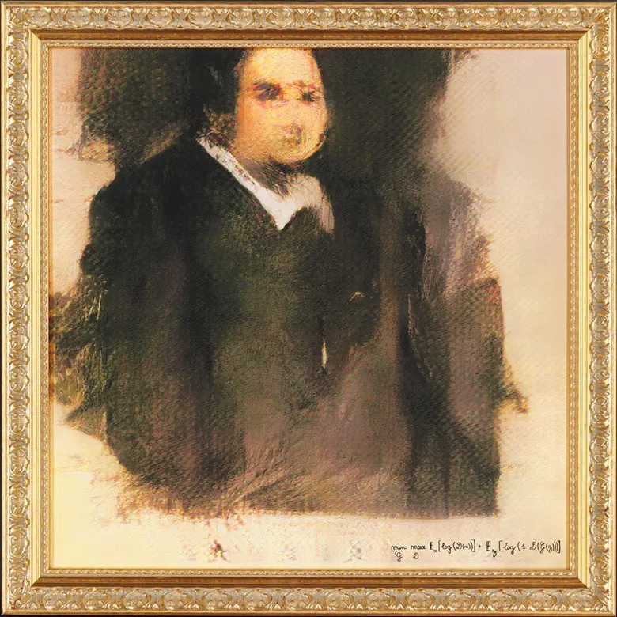

## Introduction

Do you recognize the image placeholder in this article? The image, signed with mathematical formulas, is a portion of Image 1: the **Portrait of Edmond Belamy**. This artwork, created with an AI algorithm known as a <a href="#reference-2" class="">GAN (Generative Adversarial Network)</a>, was crafted by the Paris-based collective Obvious, which includes members Hugo Caselles-Dupre, Pierre Fautrel, and Gauthier Vernier. The portrait was auctioned by Christie’s in New York from Oct 23 to 25, with an estimated sale price of \$7,000 to \$10,000<a href="#reference-1" class="cst">[1]</a>. The mathematical code signed within the image is part of the GAN’s **loss function**, contributing to its creation.

  
**Image 1: Portrait of Edmond Belamy (The overall collection is available <a href="https://obvious-art.com/la-famille-belamy/" target="_blank">here</a>)**

Generative Adversarial Networks (GANs) are a groundbreaking AI technique developed by Ian Goodfellow and his team in 2014<a href="#reference-2" class="cst">[2]</a>. The name "Belamy" in the portrait title also hints at "Bel ami," which translates from French as "Good friend," a nod to GAN creator Mr. Goodfellow.

But how did this technique, which seemingly gives imagination to computers, come to be? Let’s take a look.

## StoryTime

In 2014, while celebrating a friend’s graduation at Les 3 Brasseurs in Montreal, Ian Goodfellow was asked for help on a challenging project: creating computer-generated photos. Traditional neural networks, used as generative models, often produced blurry or incomplete images. Goodfellow initially doubted his friends' approach, as it required extensive computation. However, over a beer, he conceived a different idea: pitting two neural networks against each other. 

Later that night, he coded his idea and tested it. To his surprise, it worked on the first try. This innovation became known as a GAN, a breakthrough that opened new possibilities in artificial intelligence, particularly in fields like image synthesis, video generation, text-to-image creation, and data augmentation.

## How GANs Work

### Intuition behind

**Image 2: GAN Architecture**

The main idea behind GANs is to create a system where two networks work together to generate realistic data. This process involves a **latent space**, where the input data (whether images, text, music, or other types) is transformed into vectors that capture its core features in a simplified form. This latent space allows GANs to generate realistic variations of the data they are trained on, acting as a kind of “universal translator” of patterns and structures across data types.

A GAN has two key components: the **Generator (G)** and the **Discriminator (D)**. 

1. **Generator (G)**: The generator learns to create new samples that resemble real data. Starting from random noise, it gradually learns to produce outputs that are difficult to distinguish from actual data. For example, if the data is made up of images of 18th-century portraits, the generator will try to make images that look similar to these portraits.

2. **Discriminator (D)**: The discriminator’s role is to differentiate between real and fake samples. It learns to recognize patterns in real data and to detect when something has been artificially generated by the generator. Each time the discriminator identifies a fake, it sends feedback to the generator, which then tries to improve its creations.

This interaction between the two networks forms a competitive learning loop:

- The generator tweaks its output to make it harder for the discriminator to spot as fake.
- The discriminator, in turn, becomes more adept at identifying fakes, leading to more refined feedback for the generator.

> Training cycle

During training, both networks are presented with a mix of real images (from the training data) and fake images (created by the generator). The generator’s goal is to "fool" the discriminator into thinking its outputs are real, while the discriminator's goal is to detect which images are fake. The feedback loop continues, with each network improving over time until the generator can produce data so realistic that the discriminator struggles to tell it apart from the original data.

This competitive process ultimately leads to a balance, where the generator creates highly convincing samples and the discriminator’s ability to spot fakes is optimized.

<!-- ### Mathematical perspective
pass -->

## Applications of GANs

GANs have numerous applications across different domains. Below, we explore some of the prominent use cases of GANs and how they are implemented.

### 1. **Text-to-Image Synthesis**

One of the fascinating applications of GANs is the ability to generate images based on textual descriptions. In this process, a GAN model translates a text description (e.g., "a sunset over a mountain") into a corresponding image. This application holds significant promise for fields like graphic design, creative content generation, and digital art creation, allowing artists and content creators to generate visuals directly from their ideas.

> - Example: Generating an Image from Text with a Text-to-Image GAN
>Let’s start with a sample input text description:  
**Input Text**: “A small white cat with blue eyes, sitting on a green field with flowers.”
> 1. Text Processing (Input to Embedding)
>- The input text, “A small white cat with blue eyes, sitting on a green field with flowers,” is converted into a numerical form.
>- This is done using a text embedding model (like Word2Vec, GloVe, or a transformer-based model). The text embedding captures the meaning of the sentence in a format the GAN can understand.
> 1. Text Embedding to GAN (Conditioned Input)
>- The text embedding is then fed into the Generator of the GAN as a condition.
>- The GAN model used here is a **Conditional GAN (cGAN)**, which means the Generator and Discriminator are both conditioned on the text embedding to guide the image generation process.
> 3. Image Generation (Generator Network)
>- The **Generator** takes the text embedding along with random noise and begins generating a rough version of the image.
>- As training progresses, the Generator learns to turn random noise (a latent vector) and the text embedding into more realistic images based on the description. 
For example, the Generator first creates rough shapes of a white cat, a green field, and flowers based on the prompt.
> 4. Evaluation (Discriminator Network)
>- The **Discriminator** evaluates the image generated by the Generator, comparing it with real images that match similar descriptions.
>- The Discriminator also has access to the text embedding, so it evaluates how well the generated image matches the description.
>5. Feedback Loop
>- The Discriminator gives feedback to the Generator on how realistic and accurate the image is. Through back-and-forth training, the Generator gets better at producing images that resemble the description more closely.
>6. Refinement (Fine-Tuning Details)
>- With repeated iterations, the Generator learns to add finer details. It now knows that the cat should be small, have blue eyes, and be on a green field with flowers, ensuring that each part of the image is consistent with the text.

In this article, I will dive deep into implementing a text-to-image example from scratch using Conditional GANs (cGAN). You can read the full guide here: [Text-to-Image with cGAN](https://genereux-akotenou.github.io/blog/post/text2image-with-cgan/).

### 2. **Image Synthesis and Modification**

GANs are widely used for generating high-quality, realistic images, often indistinguishable from actual photos. This application can be broken down into several sub-use cases:
   - **Image Generation**: GANs can create new, realistic images from scratch. For instance, platforms like "<a href="https://thispersondoesnotexist.com/" target="_blank">This Person Does Not Exist</a>" generate faces that look real but do not belong to any actual person.
   - **Image Super-Resolution**: GANs can increase the resolution of low-quality images, a technique often used to improve old or pixelated images.
   - **Image Inpainting**: GANs can fill in missing parts of an image, commonly used for restoration in media where parts of the data are corrupted or lost.

### 3. **Data Augmentation**

Data augmentation with GANs addresses one of the most pressing issues in machine learning: data scarcity. GANs generate synthetic data samples to supplement real datasets, making them invaluable in fields where acquiring real data is difficult or expensive. For instance, in medical imaging, GANs generate additional MRI or X-ray images to enhance model training. This application has been crucial in fields like healthcare and scientific research, where real-world data is limited.

### 4. **Deepfake Generation**

GANs can create highly realistic videos known as "deepfakes," where the faces or voices of individuals are manipulated to create lifelike, synthetic portrayals. While deepfakes are used creatively in fields like entertainment, they also raise ethical and security concerns as they can be used to produce misinformation. Examples include recreating historical figures in modern settings or creating lifelike animated videos of popular public figures.

### 5. **Style Transfer and Artistic Creation**

GANs enable style transfer, where the style of one image (e.g., the brushstrokes of Van Gogh's Starry Night) is applied to another image. This technique has been widely adopted in digital art, allowing artists to blend styles and create unique visuals. GANs like StyleGAN are specifically designed for high-quality image generation and have been instrumental in modern digital art and design.

## Conclusion

Generative Adversarial Networks represent a breakthrough in machine learning, pushing the boundaries of what AI can achieve in creating realistic data. Their applications, from synthetic image generation to text-based image creation and beyond, show how GANs are transforming industries and opening up new possibilities. However, as with any powerful technology, GANs also raise ethical concerns, especially in cases like deepfake generation. As GAN technology evolves, it will be critical to balance innovation with responsible use to maximize the benefits of this powerful tool.

## References

1. https://fr.wikipedia.org/wiki/Portrait_d%27Edmond_de_Belamy

2. Goodfellow, Ian, Pouget-Abadie, Jean, Mirza, Mehdi, Xu, Bing, Warde-Farley, David, Ozair, Sherjil, Courville, Aaron, & Bengio, Y. (2014). Generative Adversarial Networks. *Advances in Neural Information Processing Systems*, 3. https://doi.org/10.1145/3422622.