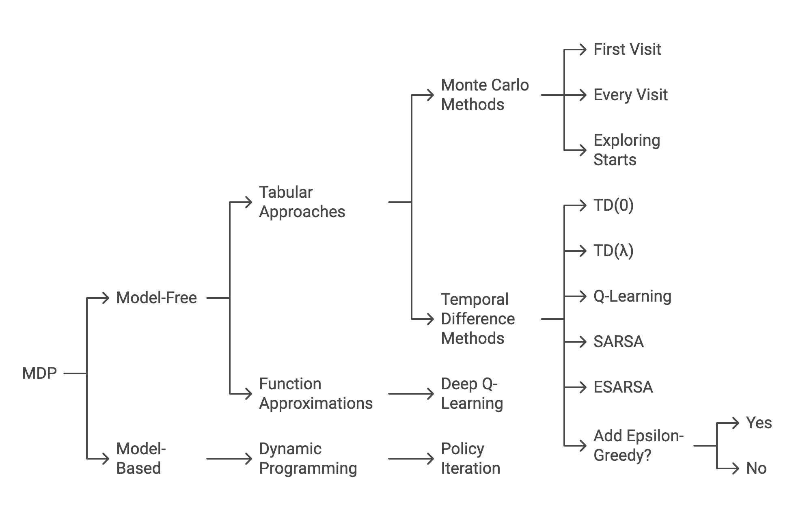

Reinforcement Learning (RL) has emerged as a powerful paradigm in artificial intelligence, enabling agents to learn optimal behaviors through interaction with their environment. In this blog page I present a short review of RL algorithms and their implementation in gaming environments, with particular focus on the RLs project implementation.

### Literature Review

The foundation of modern RL can be traced back to the work of Sutton and Barto (2018), who formalized the Markov Decision Process (MDP) framework. In this framework, an agent interacts with an environment through states, actions, and rewards, aiming to maximize cumulative rewards over time.

  
**Image 1:** RL Approach based on environment knowledge

1. **Model-Free Approaches**

Model-free RL algorithms have gained significant attention due to their ability to learn directly from experience. Q-learning, introduced by Watkins (1989), represents a fundamental approach where the agent learns action-value functions through temporal difference learning. The Q-value update rule is given by:

\[ Q(s,a) \leftarrow Q(s,a) + \alpha[r + \gamma \max_{a'}Q(s',a') - Q(s,a)] \]

where \(\alpha\) is the learning rate and \(\gamma\) is the discount factor.

Deep Q-Networks (DQN), proposed by Mnih et al. (2015), extended Q-learning by incorporating deep neural networks to approximate Q-values. Key innovations included:
- Experience replay buffer
- Target network
- Double Q-learning (Van Hasselt et al., 2016)

Policy gradient methods, such as REINFORCE (Williams, 1992) and PPO (Schulman et al., 2017), directly optimize the policy function:

\[ \nabla_\theta J(\theta) = \mathbb{E}_{\pi_\theta}[\nabla_\theta \log \pi_\theta(a|s)Q^\pi(s,a)] \]

2. **Model-Based Approaches**

Model-based RL methods learn a model of the environment dynamics. Dyna-Q (Sutton, 1990) combines real experience with simulated experience from the learned model. Monte Carlo Tree Search (MCTS), popularized by Silver et al. (2016) in AlphaGo, uses simulation and tree search to plan actions.

### Implementation: RLs Project

The RLs project demonstrates these RL methods in practice through a modular framework designed for experimentation in gaming environments. The source code is available at: [https://github.com/Genereux-akotenou/RLs](https://github.com/Genereux-akotenou/RLs)

**Project Structure**

- `algorithms/`: Implementations of Q-Learning, DQN, SARSA, etc.
- `environments/`: Includes standard (FrozenLake) and custom (EscapeGame) environments.
- `config/`: Configuration files for experiments.
- `prebuilt/`: Stores trained models.
- `x-samples/`: Notebooks and demos.
- `main.py`: Launcher for experiments.

**Setup Instructions**

1. Clone and create virtual environment:
   ```bash
   git clone https://github.com/Genereux-akotenou/RLs.git
   cd RLs
   python -m venv .rl_env
   source .rl_env/bin/activate
   pip install -r requirements.txt
   ```
2. Use `.rl_env/bin/python` as kernel in notebooks.

**Running Experiments**

1. Test a Pretrained Model
   ```bash
   python main.py --env "FrozenLake" --algo "DQN" --mode "test"        --test_episodes 3 --verbose "1"        --model_path "prebuilt/frozenlake-v1/weights_0150.weights.h5"
   ```

2. Train a DQN Agent
   ```bash
   python main.py --env "FrozenLake" --algo "DQN" --mode "train"        --output_dir "prebuilt/frozenlake-v1" --map "SFFF" "FHFH" "FFFH" "HFFG"        --batch_size 32 --n_episodes 1000 --max_steps 300 --verbose "0"
   ```

3. EscapeGame Environment
   - Fully custom logic and graphical visualization.
   - Uses chambers and rules of motion defined in `escape_game.py`.
   - Standalone demo: [Escape Game Notebook](https://github.com/Genereux-akotenou/RLs/blob/main/x-samples/standalone/qln-escape-game.ipynb)


4. Add New Algorithms
   - Add to `algorithms/` with minimal config.
   - Existing examples: DQN, Q-Learning, SARSA

**Sample Algorithm: DQN**
```python
class DQNAgent:
    def __init__(...):
        ...
        self.model = Sequential([
            Input(shape=(state_size,)),
            Dense(32, activation='relu'),
            Dense(action_size, activation='linear')
        ])
        self.model.compile(loss='mse', optimizer=Adam(...))
```

**EscapeGame Environment Highlights**

- Custom graph-like chamber connections.
- Sparse reward and deterministic transitions.
- Visualized using matplotlib.
- Q-table convergence shown in standalone notebook.

**Results and Observations**

1. Q-Learning:
   - Efficient for simple, discrete environments.
   - Struggles in high-dimensional or sparse-reward settings.

2. DQN:
   - Leverages neural networks for state-action approximation.
   - Benefits from replay buffers and target networks.

3. EscapeGame:
   - Designed to test logical reasoning.
   - Agent successfully learns to escape after few episodes.

**Future Enhancements**

1. Add multi-agent support.
2. Extend to continuous state/action spaces.
3. Benchmark multiple algorithms on the same environment.
4. Enable distributed training and visualization logs.

### References

1. Sutton, R. S., & Barto, A. G. (2018). *Reinforcement Learning: An Introduction*. MIT Press.
2. Mnih, V. et al. (2015). Human-level control through deep reinforcement learning. *Nature*.
3. Van Hasselt, H. et al. (2016). Deep Reinforcement Learning with Double Q-learning. *AAAI*.
4. Silver, D. et al. (2016). Mastering the game of Go. *Nature*.
5. Schulman, J. et al. (2017). Proximal Policy Optimization. *arXiv preprint*.

---

The RLs project is available at: [https://github.com/Genereux-akotenou/RLs](https://github.com/Genereux-akotenou/RLs) 