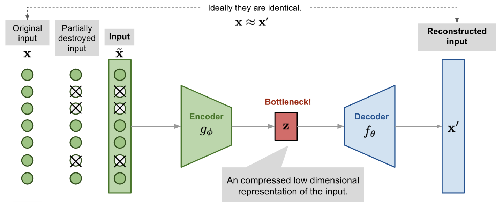
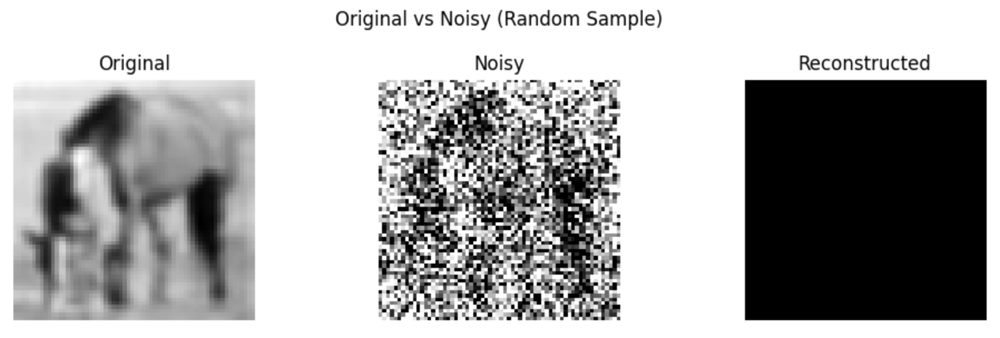
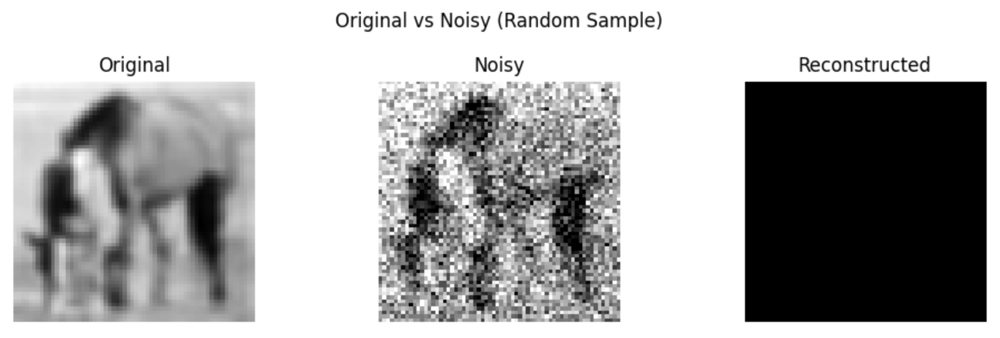
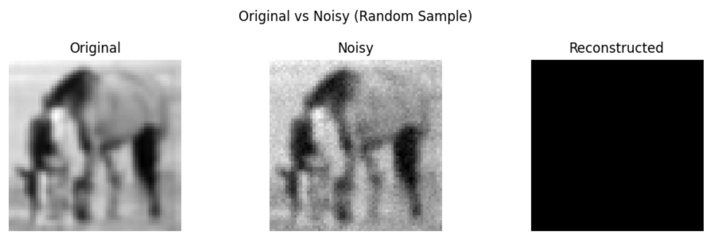
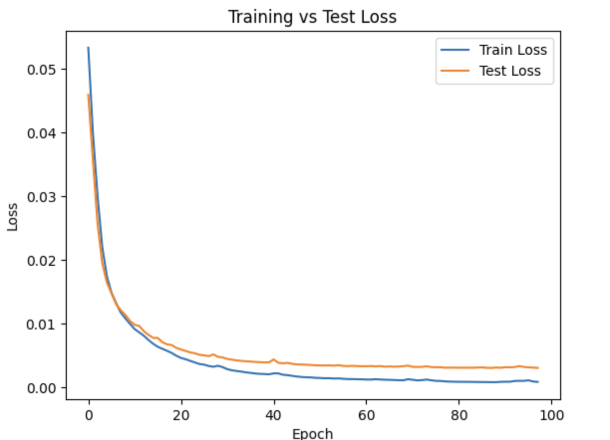
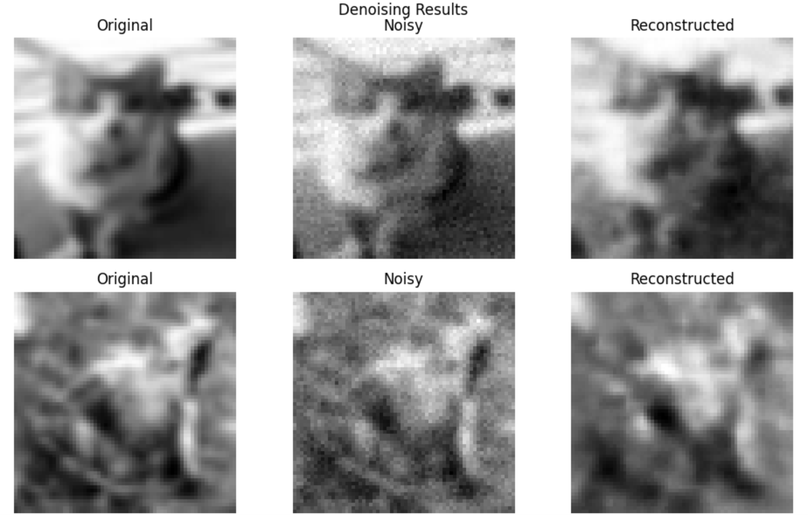
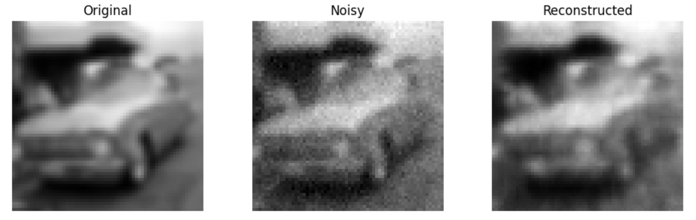
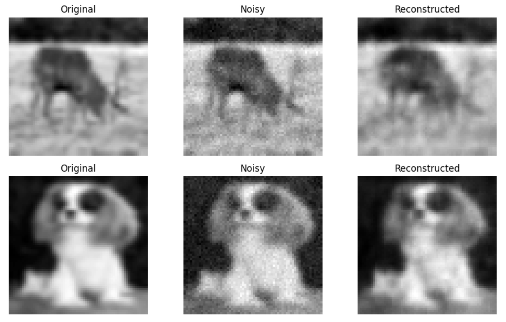

## Introduction

Autoencoders are a fascinating class of neural networks. At their core, they aim to learn efficient data representations—compressing information through an encoder and then reconstructing it with a decoder. What makes them even more compelling is their ability to learn these representations without supervision. In practice, this makes them excellent tools for applications such as image denoising, anomaly detection, and dimensionality reduction.

In this blog, we explore how a denoising autoencoder can clean up noisy grayscale images. The model learns to filter out visual noise by comparing noisy input images with their clean originals and training itself to minimize the gap between the two. The task is deceptively simple: feed the model a corrupted image, and ask it to predict what the clean version would look like. But the underlying mechanisms are what make this process powerful.

## Denoising Autoencoder

The goal of this task is to train a **Denoising Autoencoder** using a small dataset of grayscale natural images. An autoencoder is a type of neural network that learns to compress and reconstruct input data. It consists of an encoder that compresses the data into a lower-dimensional representation, and a decoder that reconstructs the original data from the compressed representation as illustrated by the image 1

<div>
  
  <span><b>Image 1: Denoising Autoencoder Architecture <a href="https://lilianweng.github.io/posts/2018-08-12-vae/" target="_blank">(source)</a></b></span>
</div>

## How the Autoencoder Sees

We begin by preparing a dataset of natural grayscale images. Each image, originally from CIFAR-10, is resized to 64x64 pixels and converted to a single channel. To make things harder for our model, we add Gaussian noise to every image. The noise levels are chosen carefully, ranging from severe to subtle. The goal is to find a level where the images are visibly corrupted, but still preserve enough structure for the model to reconstruct them meaningfully. Once the data is ready, we construct the model. The encoder compresses the input image through a series of convolutional layers followed by a linear bottleneck. This bottleneck captures the essential visual features while discarding irrelevant details like random noise. The decoder then attempts to recreate the original image by inverting the encoder’s operations. It gradually upsamples the compressed representation through transposed convolutions, with a sigmoid activation at the output to map the pixel values back into the 0 to 1 range.

**Encoder**
To implement our autoencoder to denoise images, we will first implement the encoder, which is responsible for transforming the input images into a compressed representation in the latent space. It consists of a series of convolutional and fully connected layers. This compressed representation contains essential features of the input images that capture their underlying patterns and structures and will help the encoder learn to preserve as much of the relevant information as possible within the limitations of the latent space, and cleverly discard irrelevant parts like noise. We will use the **ReLU** activation function in the encoder to introduce non-linearity, allowing the network to learn complex representations and extract important features from the input data.

**Decoder**
The decoder layer is responsible for reconstructing the images from the compressed representation in the latent space.
It mirrors the structure of the encoder and consists of a series of fully connected and transpose convolutional layers. We will use **Sigmoid** and **ReLU** activations in the decoder layer. The goal of using sigmoid in the decoder is to produce reconstructed output values in the range [0, 1]. Since the input data in this task represents binary images, sigmoid is a suitable activation function for reconstructing pixel values. We choose sigmoid here because the problem we are dealing with grayscale images.

**Training**
For this denoising task, we choose **Mean Squared Error** as the loss function and **Adam** as the optimizer. MSELoss is well-suited for image reconstruction problems involving continuous-valued grayscale images, where each pixel has a value in the range [0, 1]. Unlike Binary Cross-Entropy (BCE), which is typically used for binary classification tasks or binary pixel outputs (0 or 1), MSE penalizes the average squared difference between the predicted and target pixel values — making it more appropriate when pixel intensities can vary smoothly. We also use the **Adam optimizer**, which provides adaptive learning rates for each parameter and generally leads to faster convergence compared to SGD in deep learning tasks.

Now that we have a clear idea, let's start with the code.


## Import Utils
```python
import torch, glob, random
import torch.nn as nn
import torch.optim as optim
import torchvision
from torch.utils.data import DataLoader, random_split, TensorDataset, Subset
from torchvision import datasets, transforms
import matplotlib.pyplot as plt
from pathlib import Path
from PIL import Image
import pandas as pd
import numpy as np
```


**Let's implementent some helper functions**
```python
class Helper:
    @staticmethod
    def add_gaussian_noise(images, noise_level=0.2, mean=0.0):
        """
        Adds visually balanced Gaussian noise to images.
        """
        std = noise_level
        noise = torch.randn_like(images) * std + mean
        noisy_images = images + noise
        return torch.clamp(noisy_images, 0., 1.)

    @staticmethod
    def show_images(original, noisy, reconstructed, n=5, title='Denoising Results'):
        """
        Display original, noisy, and reconstructed images side by side.
        """
        fig, axes = plt.subplots(n, 3, figsize=(10, 3 * n))
        if n == 1:
            axes = axes.reshape(1, 3)
        for i in range(n):
            axes[i, 0].imshow(original[i].squeeze().cpu(), cmap='gray')
            axes[i, 0].set_title("Original")
            axes[i, 1].imshow(noisy[i].squeeze().cpu(), cmap='gray')
            axes[i, 1].set_title("Noisy")
            axes[i, 2].imshow(reconstructed[i].detach().squeeze().cpu(), cmap='gray')
            axes[i, 2].set_title("Reconstructed")
            for j in range(3):
                axes[i, j].axis('off')
        plt.suptitle(title)
        plt.tight_layout()
        plt.show()
```
## Dataset: 
Load → Transform → Train-Test Split

For this assignment, we chose the CIFAR-10 dataset. Since the original images are 32×32 in resolution, we first resize them to 64×64 to match the task requirements and convert them to grayscale. We then take a sample of 100 images and split them into training and testing sets using the classic 80/20 split to ensure separation between the two. Finally, we prepare the corresponding data loaders for training and testing.
```python
# We apply this base transform to keep all images 64x64 and convert them to 64x64
base_transform = transforms.Compose([
    transforms.Resize((64, 64)),
    transforms.Grayscale()
])
# As we have to work with 100 images only we will augment the dataset
augmentation_transform = transforms.Compose([
    transforms.RandomHorizontalFlip(),                
    transforms.RandomVerticalFlip(), 
    transforms.RandomResizedCrop(size=64, scale=(0.9, 1.0)),
    transforms.ColorJitter(brightness=0.1, contrast=0.1)
])


# We load and select 100 images
raw_dataset = torchvision.datasets.CIFAR10(root='./data', train=True, download=True)
subset, _ = random_split(raw_dataset, [100, len(raw_dataset) - 100])

# Offline augmentation, original + n augmentations
augmented_images = []
n_augment = 10
for img, _ in subset:
    base = base_transform(img)
    base_tensor = transforms.ToTensor()(base)
    augmented_images.append(base_tensor) 
    for _ in range(n_augment):
        aug_img = augmentation_transform(base)
        aug_tensor = transforms.ToTensor()(aug_img)
        augmented_images.append(aug_tensor)

# We create the dataset and do train-test split
all_data = torch.stack(augmented_images)
dataset = TensorDataset(all_data)
train_set, test_set = random_split(dataset, [int(0.8 * len(dataset)), len(dataset) - int(0.8 * len(dataset))])

# We finally prepare dataloader for trainer
train_loader = DataLoader(train_set, batch_size=64, shuffle=True)
test_loader = DataLoader(test_set, batch_size=64)
```
**Noise Level**

To determine a suitable noise level for training the denoising autoencoder, we conduct several manual tests. The goal is to identify a noise intensity that ensures the added noise is clearly visible in the images, while still preserving enough of the original content for meaningful reconstruction. This balance is essential: the noise should be strong enough to challenge the model, but not so extreme that the underlying structure of the image is lost.
```python
# Let test our noise function
idx = 737#random.randint(0, len(dataset) - 1)
original_img = dataset[idx][0]
original_batch = original_img.unsqueeze(0)
reconstructed_batch = torch.zeros(size=original_batch.shape)

noisy_batch = Helper.add_gaussian_noise(original_batch, noise_level=0.5)
Helper.show_images(original_batch, noisy_batch, reconstructed_batch, n=1, title="Original vs Noisy (Random Sample)")
```
  

```python
noisy_batch = Helper.add_gaussian_noise(original_batch, noise_level=0.2)
Helper.show_images(original_batch, noisy_batch, reconstructed_batch, n=1, title="Original vs Noisy (Random Sample)")
```
  

```python
noisy_batch = Helper.add_gaussian_noise(original_batch, noise_level=0.1)
Helper.show_images(original_batch, noisy_batch, reconstructed_batch, n=1, title="Original vs Noisy (Random Sample)")
```
  


```python
noisy_batch = Helper.add_gaussian_noise(original_batch, noise_level=0.03)
Helper.show_images(original_batch, noisy_batch, reconstructed_batch, n=1, title="Original vs Noisy (Random Sample)")
```
  

Conclusion: For our experiement we will use `noise_level=0.3`

## Model

DenoisingAutoencoder uses a convolutional encoder-decoder architecture with a fully connected latent bottleneck layer. The encoder compresses a 64x64 grayscale image into a low-dimensional latent vector (default size: 128), and the decoder reconstructs the image from this latent space. ReLU and Sigmoid activations help learn non-linear representations and normalize output pixel values.
```python
class DenoisingAutoencoder(nn.Module):
    def __init__(self, input_channels=1, latent_dim=128):
        super().__init__()

        self.encoder = nn.Sequential(
            nn.Conv2d(input_channels, 32, kernel_size=3, stride=2, padding=1),
            nn.ReLU(),
            nn.Conv2d(32, 64, kernel_size=3, stride=2, padding=1),              
            nn.ReLU(),
            nn.Conv2d(64, 128, kernel_size=3, stride=2, padding=1),    
            nn.ReLU()
        )
        
        self.flatten = nn.Flatten()
        self.latent = nn.Linear(128 * 8 * 8, latent_dim)  
        self.unlatent = nn.Linear(latent_dim, 128 * 8 * 8)
        self.unflatten = nn.Unflatten(1, (128, 8, 8))   
        
        self.decoder = nn.Sequential(
            nn.ConvTranspose2d(128, 64, kernel_size=3, stride=2, padding=1, output_padding=1), 
            nn.ReLU(),
            nn.ConvTranspose2d(64, 32, kernel_size=3, stride=2, padding=1, output_padding=1), 
            nn.ReLU(),
            nn.ConvTranspose2d(32, input_channels, kernel_size=3, stride=2, padding=1, output_padding=1), 
            nn.Sigmoid()
        )

    def forward(self, x):
        x = self.encoder(x)                  
        x = self.flatten(x)             
        x = self.latent(x)                    
        x = self.unlatent(x)            
        x = self.unflatten(x)                
        y = self.decoder(x)                  
        return y
```
```python
model = DenoisingAutoencoder()
```

## Trainer

This class manages training and evaluation of the denoising autoencoder model. It includes a compile step to define the loss and optimizer, and supports Gaussian noise injection, loss tracking, and optional early stopping.
```python
class Trainer:
    def __init__(self, model, train_loader, test_loader, noise_fn, noise_level, device=None, verbose=True):
        self.device = device or torch.device('cuda' if torch.cuda.is_available() else 'cpu')
        self.model = model.to(self.device)
        self.train_loader = train_loader
        self.test_loader = test_loader
        self.noise_fn = noise_fn
        self.noise_level = noise_level
        self.verbose = verbose
        self.criterion = None
        self.optimizer = None
        self.train_losses = []
        self.test_losses = []

    def compile(self, loss_fn, optimizer_class, lr=0.001):
        """
        Mimics Keras-style compile method to define loss and optimizer.
        """
        self.criterion = loss_fn
        self.optimizer = optimizer_class(self.model.parameters(), lr=lr)

    def train(self, num_epochs=20, early_stopping_patience=None):
        """
        Trains the model, with optional early stopping.
        """
        if self.criterion is None or self.optimizer is None:
            raise ValueError("You must call compile() before training.")

        best_loss = float('inf')
        patience_counter = 0

        for epoch in range(num_epochs):
            self.model.train()
            running_loss = 0.0
            for inputs in self.train_loader:
                inputs = inputs[0].to(self.device)
                noisy_inputs = self.noise_fn(inputs, self.noise_level)
                outputs = self.model(noisy_inputs)
                loss = self.criterion(outputs, inputs)

                self.optimizer.zero_grad()
                loss.backward()
                self.optimizer.step()
                running_loss += loss.item()

            epoch_train_loss = running_loss / len(self.train_loader)
            self.train_losses.append(epoch_train_loss)

            # evaluation
            self.model.eval()
            running_test_loss = 0.0
            with torch.no_grad():
                for inputs in self.test_loader:
                    inputs = inputs[0].to(self.device)
                    noisy_inputs = self.noise_fn(inputs, self.noise_level)
                    outputs = self.model(noisy_inputs)
                    loss = self.criterion(outputs, inputs)
                    running_test_loss += loss.item()
            epoch_test_loss = running_test_loss / len(self.test_loader)
            self.test_losses.append(epoch_test_loss)

            if self.verbose:
                print(f"Epoch {epoch+1}: Train Loss = {epoch_train_loss:.4f}, Test Loss = {epoch_test_loss:.4f}")

            # early stopping check
            if early_stopping_patience is not None:
                if epoch_test_loss < best_loss:
                    best_loss = epoch_test_loss
                    patience_counter = 0
                else:
                    patience_counter += 1
                    if patience_counter >= early_stopping_patience:
                        print(f"Early stopping triggered at epoch {epoch+1}")
                        break

    def get_losses(self):
        return self.train_losses, self.test_losses
```

**Run training**
```python
trainer = Trainer(
    model, 
    train_loader=train_loader, 
    test_loader=test_loader, 
    noise_fn=Helper.add_gaussian_noise,
    noise_level=0.03,
    verbose=False
)
trainer.compile(loss_fn=nn.MSELoss(), optimizer_class=optim.Adam, lr=0.001)
trainer.train(num_epochs=200, early_stopping_patience=10)
```
Early stopping triggered at epoch 98

## Results Analysis
```python
plt.plot(train_losses, label="Train Loss")
plt.plot(test_losses, label="Test Loss")
plt.xlabel("Epoch")
plt.ylabel("Loss")
plt.title("Training vs Test Loss")
plt.legend()
plt.show()
```
  

Let's visualize a few reconstructions
```python
device = torch.device('cuda' if torch.cuda.is_available() else 'cpu')
inputs = next(iter(test_loader))
inputs = inputs[0].to(device)
noisy_inputs = Helper.add_gaussian_noise(inputs, noise_level=0.03)
outputs = model(noisy_inputs)
Helper.show_images(inputs.cpu(), noisy_inputs.cpu(), outputs.cpu(), n=5)
```
 
 
 


**Conclusion:** 
The reconstruction results in the image indicate that the denoising autoencoder performs well in removing noise and restoring the essential structure of the input images. The training and validation loss curves both show a consistent downward trend and convergence, suggesting effective learning without overfitting. Visually, the reconstructed images closely resemble the original ones, especially in preserving overall shapes and edges, although some fine details appear slightly blurred. This blurriness is a common artifact of autoencoders trained with pixel-wise loss functions like MSE, which tend to favor smooth outputs over sharp, detailed reconstructions. Overall, the model generalizes effectively to noisy inputs, capturing the key visual patterns necessary for denoising while showing minor limitations in recovering high-frequency details.

