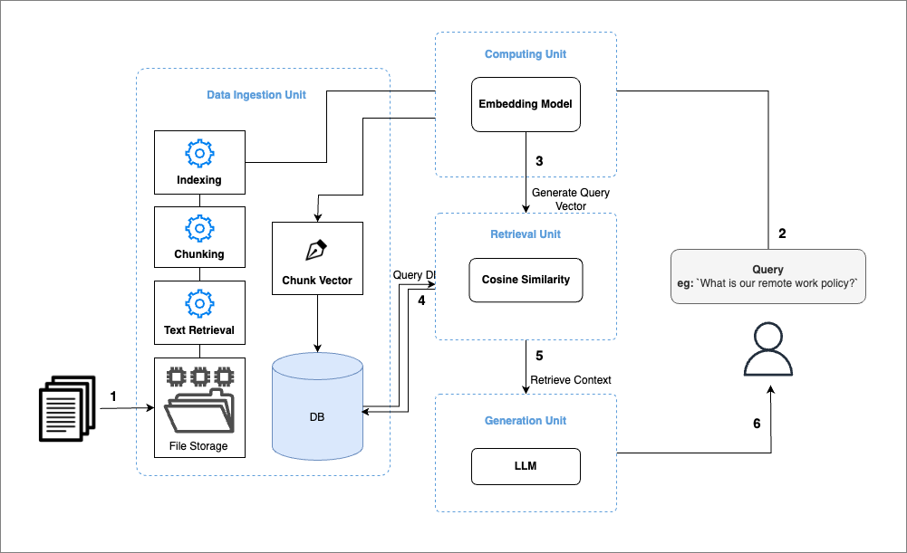
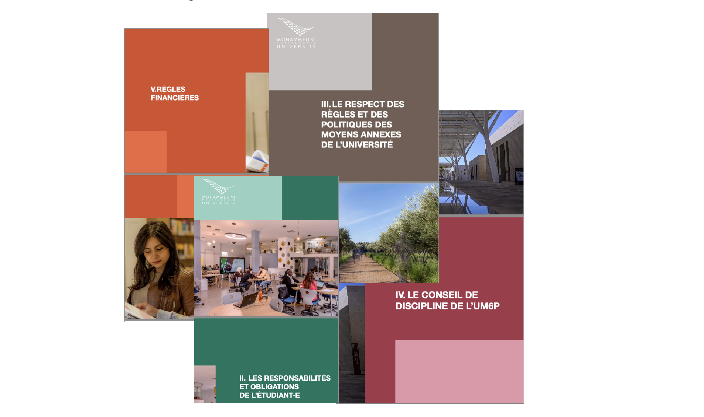

# Building a Retrieval-Augmented Generation (RAG) ChatBot

**Retrieval-Augmented Generation (RAG) bridges the gap between general and specific data understanding, enabling Large Language Models (LLMs) to generate accurate, data-specific responses.**

## Introduction to RAG
Large Language Models (LLMs) excel at reasoning with general data, but their performance diminishes when tasked with specific data, particularly when that data was generated after their training. To create applications that can comprehend private information or details beyond the model's existing knowledge, it is essential to enrich the model's understanding with specific information. This process of retrieving relevant information and integrating it into the model to generate accurate responses for particular datasets is referred to as Retrieval Augmented Generation (RAG).

In short points: 
- **General vs. Specific Data**: LLMs, like GPT models, excel at reasoning over general data but often falter with domain-specific or recently updated information.
- **Challenge**: LLMs cannot natively process new information that arises post-training.
- **Solution**: RAG provides a framework for retrieving relevant data from external sources and augmenting LLM outputs. This hybrid approach ensures responses are both data-rich and contextually accurate.

### RAG Workflow
The RAG architecture involves:
- **Data Ingestion**: Collecting, chunking, and embedding data for efficient retrieval.
- **Retrieval Process**: Using embeddings to fetch the most relevant pieces of information.
- **Generation**: Combining retrieved data with the LLM for response generation.

  
**Image 1: RAG Workflow Illustration**

### Objectives
  

<div style="background-color: #f68f64; color: white; padding: 0.7em; border-radius: 0.4em;">
The main goal of this paper is to develop a RAG-powered ChatBot following the architecture proposed in <a href="#image-1">Image 1</a> that assists students by providing easily accessible and up-to-date information about university regulations. We will build the chatbot using the Llama3 model. To enable this model to work on private documents and deliver accurate results, we will carefully select and build a more precise context for the LLM using RAG.
</div>

### Data Ingestion Pipeline
This section outlines the development of the Data Ingestion pipeline, which forms the first component of our architecture (see Image 1). We begin by implementing a Python script to orchestrate the data ingestion process and later automate this workflow using tools like Apache Airflow. Here is a breakdown of our objectives and the steps involved:

---
#####  Objectives
- Build a Data Ingestion pipeline to process new documents.
- Automate the detection and processing of documents using Apache Airflow.
- Extract text from various document formats and convert them into manageable chunks.
- Index these chunks and generate embedding vectors to store in a database.

#####  Setup
Let's install and import utils
```python
%pip install llama-index-readers-file pymupdf
%pip install llama-index-vector-stores-postgres
%pip install llama-index-embeddings-hugging face
%pip install llama-index-llms-llama-cpp
%pip install llama-cpp-python
```
```python
from llama_index.embeddings.huggingface import HuggingFaceEmbedding
from tqdm import tqdm
import os
```

We need to convert text into vectors as a key functionality. Our goal is to build a chatbot for French documents, so we researched embedding models available on Hugging Face. Using the leaderboard at [this link](https://huggingface.co/spaces/mteb/leaderboard), we selected `bge-m3-custom-fr` for its optimal balance between computational efficiency and performance. Refer to <a href="#image-2">Image 2</a> below, which illustrates the model parameters we considered for this choice.

  
**Image 2: Model Parameter Selection for RAG Workflow**

We then create an instance of our embedding model using the following code:

```python
embed_model = HuggingFaceEmbedding(model_name="manu/bge-m3-custom-fr")
```
Once we have the embedding model, we need a storage database to store the vectors of document chunks that our chatbot will use.

```bash
# Let's create database folder to setup our DB
! mkdir database
```
We then need to create a `docker-compose.yml` file to provision a PostgreSQL database that supports `pgvector`. This support is important because `pgvector` allows us to efficiently handle and query vector data within our database.
```yaml
%%writefile database/docker-compose.yml
version: '3.8'
services:
  RAG_DB:
    image: ankane/pgvector
    container_name: rag_vector_db
    environment:
      POSTGRES_DB: rag_vector_db
      POSTGRES_USER: rag_user
      POSTGRES_PASSWORD: rag_password
    ports:
      - "5433:5432"
    volumes:
      - ./pgdata:/var/lib/postgresql/data
```
We then start our Docker container to provision the database server:

```bash
! cd database ; docker-compose up -d RAG_DB
```
Expected output:

```log
[+] Running 1/0
 ✔ Container rag_vector_db  Running 
 ```

After installing and starting our Docker container that provisions a database server on port 5433, we connect to the database and set it up. We use `pgvector` for efficient manipulation of vector data. The following code connects to the server and creates our database:

```python
import psycopg2

# DB Parameters
db_name = "rag_vector_db"
host = "localhost"
password = "rag_password"
port = "5433"
user = "rag_user"

# Connect and create db
conn = psycopg2.connect(
    dbname="postgres",
    host=host,
    password=password,
    port=port,
    user=user,
)
conn.autocommit = True
with conn.cursor() as c:
    c.execute(f"DROP DATABASE IF EXISTS {db_name}")
    c.execute(f"CREATE DATABASE {db_name}")
```
Next, we set up **PGVectorStore**, which provides functionality for writing and querying vector data in PostgreSQL:

```python
from llama_index.vector_stores.postgres import PGVectorStore

vector_store = PGVectorStore.from_params(
    database=db_name,
    host=host,
    password=password,
    port=port,
    user=user,
    table_name="rag_paper_fr",
    embed_dim=1024,  # (384) openai embedding dimension
)
```

1. Load Data: We have folder named `documents` which contain .pdf documents. This spinet of code extract text from each pdf and store them as list of docements.
```python
from pathlib import Path
from llama_index.readers.file import PyMuPDFReader

# Utils
loader = PyMuPDFReader()
directory_path = Path("./documents")
pdf_files = directory_path.glob("*.pdf")

# Process and rename all PDF files
documents = []
for file_path in pdf_files:
    loaded_docs = loader.load(file_path=str(file_path))
    documents.extend(loaded_docs)
    treated_file_path = file_path.with_name(f"{file_path.stem}.pdf")
    file_path.rename(treated_file_path)
```

2. Create document chuncks: Chunking plays a crucial role in building RAG. Since the documents can be large, it’s necessary to split them into manageable sizes to ensure efficient indexing and retrieval. We must define a chunk_size, which specifies the number of tokens each chunk will contain.

```python
from llama_index.core.node_parser import SentenceSplitter
text_parser = SentenceSplitter(
    chunk_size=1024,
)

text_chunks = []
doc_idxs = [] #<- to save index
for doc_idx, doc in enumerate(documents):
    cur_text_chunks = text_parser.split_text(doc.text)
    text_chunks.extend(cur_text_chunks)
    doc_idxs.extend([doc_idx] * len(cur_text_chunks))
```

3. Let's link each chunck to document sources metadata (Node Chunk)
```python
from llama_index.core.schema import TextNode

nodes = []
for idx, text_chunk in enumerate(text_chunks):
    node = TextNode(
        text=text_chunk,
    )
    src_doc = documents[doc_idxs[idx]]
    node.metadata = src_doc.metadata
    nodes.append(node)
```

4. Generate embeddings for each Node
```python
for node in tqdm(nodes, ncols=100, desc="Generating embedding: "):
    node_embedding = embed_model.get_text_embedding(
        node.get_content(metadata_mode="all")
    )
    node.embedding = node_embedding
```
