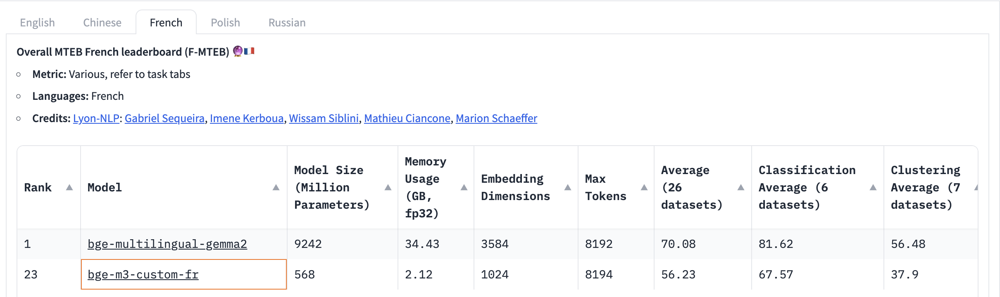
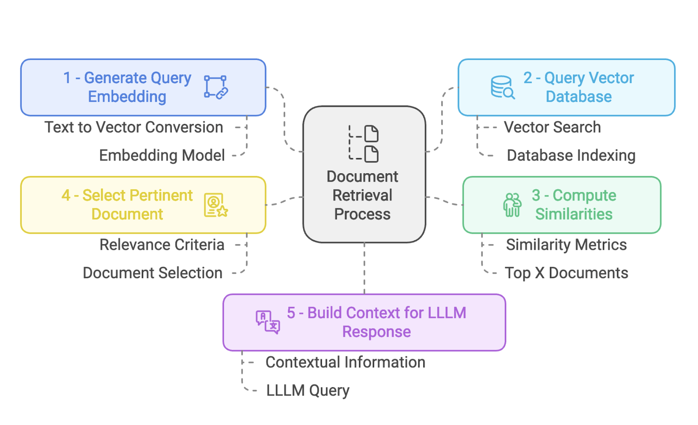

**Retrieval-Augmented Generation (RAG) bridges the gap between general and specific data understanding, enabling Large Language Models (LLMs) to generate accurate, data-specific responses.**

# Introduction to RAG
Large Language Models (LLMs) excel at reasoning with general data, but their performance diminishes when tasked with specific data, particularly when that data was generated after their training. To create applications that can comprehend private information or details beyond the model's existing knowledge, it is essential to enrich the model's understanding with specific information. This process of retrieving relevant information and integrating it into the model to generate accurate responses for particular datasets is referred to as Retrieval Augmented Generation (RAG).

In short points: 
- **General vs. Specific Data**: LLMs, like GPT models, excel at reasoning over general data but often falter with domain-specific or recently updated information.
- **Challenge**: LLMs cannot natively process new information that arises post-training.
- **Solution**: RAG provides a framework for retrieving relevant data from external sources and augmenting LLM outputs. This hybrid approach ensures responses are both data-rich and contextually accurate.

## RAG Workflow
The RAG architecture involves:
- **Data Ingestion**: Collecting, chunking, and embedding data for efficient retrieval.
- **Retrieval Process**: Using embeddings to fetch the most relevant pieces of information.
- **Generation**: Combining retrieved data with the LLM for response generation.

  
**Image 1: RAG Workflow Illustration**

## Objectives
  

<div style="background-color: #f68f64; color: white; padding: 0.7em; border-radius: 0.4em;">
The main goal of this paper is to develop a RAG-powered ChatBot following the architecture proposed in <a href="#image-1">Image 1</a> that assists students by providing easily accessible and up-to-date information about university regulations. We will build the chatbot using the Llama3 model. To enable this model to work on private documents and deliver accurate results, we will carefully select and build a more precise context for the LLM using RAG.
</div>

## Data Ingestion Pipeline
This section outlines the development of the Data Ingestion pipeline, which forms the first component of our architecture (see Image 1). We begin by implementing a Python script to orchestrate the data ingestion process and later automate this workflow using tools like Apache Airflow. Here is a breakdown of our objectives and the steps involved:

---

###  Objectives
- Build a Data Ingestion pipeline to process new documents.
- Extract text from various document formats and convert them into manageable chunks.
- Index these chunks and generate embedding vectors to store in a database.

###  Setup
In our root directory, we will create a development folder to house all our scripts. For the initial processing step, we will create a new `.ipynb` file that will contain the complete data processing pipeline.

```diff
  ├─┬ DEV
+   ├── 1_Data_Ingestion.ipynb
    ├── 2_Context_Retrieval.ipynb
    ├── database
    ├─┬ documents
    │ └── *.pdf(Folder to add new documents)
```


In this section we edit the `1_Data_Ingestion.ipynb` file. Let's install and import utils

```python
%pip install llama-index-readers-file pymupdf
%pip install llama-index-vector-stores-postgres
%pip install llama-index-embeddings-hugging face
%pip install llama-index-llms-llama-cpp
%pip install llama-cpp-python
```

```python
from llama_index.embeddings.huggingface import HuggingFaceEmbedding
from tqdm import tqdm
import os
```

We need to convert text into vectors as a key functionality. Our goal is to build a chatbot for French documents, so we researched embedding models available on Hugging Face. Using the leaderboard at [this link](https://huggingface.co/spaces/mteb/leaderboard), we selected `bge-m3-custom-fr` for its optimal balance between computational efficiency and performance. Refer to <a href="#image-2">Image 2</a> below, which illustrates the model parameters we considered for this choice.

  
**Image 2: Model Parameter Selection for RAG Workflow**

We then create an instance of our embedding model using the following code:

```python
embed_model = HuggingFaceEmbedding(model_name="manu/bge-m3-custom-fr")
```
Once we have the embedding model ready, we need a database to store the vectors of document chunks that our chatbot will use.

```bash
# Let's create database folder to setup our DB
! mkdir database
```
Next, we need to create a `docker-compose.yml` file to provision a PostgreSQL database that supports `pgvector`. This support is essential because `pgvector` allows us to efficiently handle and query vector data within our database.
```yaml
%%writefile database/docker-compose.yml
version: '3.8'
services:
  RAG_DB:
    image: ankane/pgvector
    container_name: rag_vector_db
    environment:
      POSTGRES_DB: rag_vector_db
      POSTGRES_USER: rag_user
      POSTGRES_PASSWORD: rag_password
    ports:
      - "5433:5432"
    volumes:
      - ./pgdata:/var/lib/postgresql/data
```
We then start our Docker container to provision the database server:

```bash
! cd database ; docker-compose up -d RAG_DB
```
Expected output:

```plaintext
[+] Running 1/0
 ✔ Container rag_vector_db  Running 
 ```

After installing and starting our Docker container that provisions a database server on port 5433, we connect to the database and set it up. We use `pgvector` for efficient manipulation of vector data. The following code connects to the server and creates our database:

```python
import psycopg2

# DB Parameters
db_name = "rag_vector_db"
host = "localhost"
password = "rag_password"
port = "5433"
user = "rag_user"

# Connect and create db
conn = psycopg2.connect(
    dbname="postgres",
    host=host,
    password=password,
    port=port,
    user=user,
)
conn.autocommit = True
with conn.cursor() as c:
    c.execute(f"DROP DATABASE IF EXISTS {db_name}")
    c.execute(f"CREATE DATABASE {db_name}")
```

Next, we set up **PGVectorStore**, which provides functionality for writing and querying vector data in PostgreSQL:

```python
from llama_index.vector_stores.postgres import PGVectorStore

vector_store = PGVectorStore.from_params(
    database=db_name,
    host=host,
    password=password,
    port=port,
    user=user,
    table_name="rag_paper_fr",
    embed_dim=1024,  # (384) openai embedding dimension
)
```
###  Load Data

We have a folder named `documents` that contains .pdf documents. This snippet of code extracts text from each PDF and stores them as a list of documents:

```python
from pathlib import Path
from llama_index.readers.file import PyMuPDFReader

# Utils
loader = PyMuPDFReader()
directory_path = Path("./documents")
pdf_files = directory_path.glob("*.pdf")

# Process and rename all PDF files
documents = []
for file_path in pdf_files:
    loaded_docs = loader.load(file_path=str(file_path))
    documents.extend(loaded_docs)
    treated_file_path = file_path.with_name(f"{file_path.stem}.pdf")
    file_path.rename(treated_file_path)
```

###  Create document chuncks

Chunking plays a crucial role in building RAG. Since documents can be large, it’s necessary to split them into manageable sizes to ensure efficient indexing and retrieval. We must define a `chunk_size`, which specifies the number of tokens each chunk will contain.

```python
from llama_index.core.node_parser import SentenceSplitter
text_parser = SentenceSplitter(
    chunk_size=1024,
)

text_chunks = []
doc_idxs = [] #<- to save index
for doc_idx, doc in enumerate(documents):
    cur_text_chunks = text_parser.split_text(doc.text)
    text_chunks.extend(cur_text_chunks)
    doc_idxs.extend([doc_idx] * len(cur_text_chunks))
```

Let's link each chunck to document sources metadata (Node Chunk)
```python
from llama_index.core.schema import TextNode

nodes = []
for idx, text_chunk in enumerate(text_chunks):
    node = TextNode(
        text=text_chunk,
    )
    src_doc = documents[doc_idxs[idx]]
    node.metadata = src_doc.metadata
    nodes.append(node)
```

### Generate embeddings for each Node

```python
for node in tqdm(nodes, ncols=100, desc="Generating embedding: "):
    node_embedding = embed_model.get_text_embedding(
        node.get_content(metadata_mode="all")
    )
    node.embedding = node_embedding
```
Generating embedding: 100%|████████████████████| 166/166 [01:14<00:00,  2.24it/s]

We cna get a look quick of the content of the first node: 
```python
nodes[0].dict().keys()
```
dict_keys(['id_', 'embedding', 'metadata', 'excluded_embed_metadata_keys', 'excluded_llm_metadata_keys', 'relationships', 'text', 'mimetype', 'start_char_idx', 'end_char_idx', 'text_template', 'metadata_template', 'metadata_seperator', 'class_name'])

```python
nodes[0].dict()['id_']
```
'cf92f9c9-834c-4e2e-896d-1b11dfb1fc0a'

```python
nodes[0].dict()['metadata']
```
{'total_pages': 6,
 'file_path': 'documents/UM6P-Disciplinary_Council.pdf',
 'source': '1'}

We could the the built embedding here: 

```python
nodes[0].dict()['embedding']
```
[-0.030031858012080193,
 -0.038829609751701355,
 -0.0006665196851827204,
 -0.06863262504339218,
 -0.033711548894643784,
 0.020719563588500023,
 0.014222200959920883,
 -0.0631137564778328,
 -0.029535768553614616,
 -0.0323270708322525,
 0.002012217417359352,
 -0.012179107405245304,
 -0.01191095542162656
  ...
 -0.01191095542162656]

```python
len(nodes[0].dict()['embedding'])
```
1024

5. Store embedding vector into PostgresSQL DB: 

Finally, we store the generated embeddings for each document chunk in the database. This setup ensures that when we initiate the retrieval process for a given query, we can efficiently access the vector that best matches the input, enabling quick and accurate information retrieval.

```python
vector_store.add(nodes)
```

## Retrieval and Generation pipeline

  
<!-- **Image 3: Model Parameter Selection for RAG Workflow** -->


In this section we will edit `2_Data_Ingestion.ipynb` file:

```diff
  ├─┬ DEV
    ├── 1_Data_Ingestion.ipynb
+   ├── 2_Context_Retrieval.ipynb
    ├── database
    ├─┬ documents
    │ └── *.pdf(Folder to add new documents)
```
### Context Retrieval

Let's say we have one query about `how we can join the career center at UM6P ?` The first step is to build an embedding vector corresponding to our query, as shown in the code cell above.

```python
from llama_index.embeddings.huggingface import HuggingFaceEmbedding

embed_model = HuggingFaceEmbedding(model_name="manu/bge-m3-custom-fr")
query_str   = "Comment contacter le carrier center ?"
query_embedding = embed_model.get_query_embedding(query_str)
```

The next step is to query our vector database to search for the document chunk that best matches our query. The following code will search for the top 2 matching documents using `cosine similarity`.

```python
from llama_index.core.vector_stores import VectorStoreQuery

query_mode = "default" # "sparse" or "hybrid"

vector_store_query = VectorStoreQuery(
    query_embedding=query_embedding, similarity_top_k=2, mode=query_mode
)
```

As we are doing this in a new notebook, we need to connect to our database and retrieve our vector store so we can launch our similarity search.

```python
from llama_index.vector_stores.postgres import PGVectorStore

# DB Parameters
db_name = "rag_vector_db"
host = "localhost"
password = "rag_password"
port = "5433"
user = "rag_user"

vector_store = PGVectorStore.from_params(
    database=db_name,
    host=host,
    password=password,
    port=port,
    user=user,
    table_name="rag_paper_fr",
    embed_dim=1024,
)

# Similarity search
query_result = vector_store.query(vector_store_query)
```
```python
query_result.ids
```
Here we have ids of matching documents: 
['0d538711-cf99-46b1-af72-1aff9f98474b',
 'c4e5c5b5-9134-4c25-a84f-76c89ab4aff9']

We can even look at similarityes score :
```python
query_result.similarities
```
[0.62223181459782, 0.5314870793513788]

```python
query_result.nodes
```
The ouput should look like this:
```plaintext
[TextNode(id_='0d538711-cf99-46b1-af72-1aff9f98474b', embedding=None, metadata={'total_pages': 2, 'file_path': 'documents/UM6P-Phone_contact.pdf', 'source': '1'}, excluded_embed_metadata_keys=[], excluded_llm_metadata_keys=[], relationships={}, text='62\nCONTACTS\xa0:\nAdresse email\nTéléphone\nCareer Center\nComplexe sportif \nFacilities\nHealth Center\nHelpdesk informatique\nLanguage Lab\nLearning Center / \nBibliothèque\nMahir center\nBenguerir : Career.center@um6p.ma \nRabat : SCALE\nPole.sport@um6p.ma pour le \ncampus de Benguerir\nPole.sportcr@um6p.ma pour le \ncampus de Rabat\nHébergement : housingrequest@um6p.ma\nRestauration : cateringrequest@um6p.ma\nConsultation à distance\nAstreinte Health Center 7j/7\net 24H/24\nhealth.center@um6p.ma \nBenguérir : helpdesk@um6p.ma \nAstreinte 7j/7 et 24H/24\nIT Support RABAT:\nit-support-rabat@um6p.ma\nlanguagelab@um6p.ma \nBenguérir : lc@um6p.ma\nPortail : https://learningcenter.um6p.ma\nBureaux des aides documentalistes :\nBureau 1\nBureau 2\nRabat : bibliotheque.fgses@um6p.ma\nhttps://biblio.fgses-um6p.ma/\nmahircenter@um6p.ma \n05 25 07 27 00\n05 25 07 27 10\n06 16 14 01 93\n06 66 96 80 08\n05 25 07 32 04\n06 78 82 69 33 \n05 30 43 15 15\n05 25 07 28 97 \n05 25 07 32 00', mimetype='text/plain', start_char_idx=None, end_char_idx=None, text_template='{metadata_str}\n\n{content}', metadata_template='{key}: {value}', metadata_seperator='\n'),
 TextNode(id_='c4e5c5b5-9134-4c25-a84f-76c89ab4aff9', embedding=None, metadata={'total_pages': 2, 'file_path': 'documents/UM6P-Phone_contact.pdf', 'source': '2'}, excluded_embed_metadata_keys=[], excluded_llm_metadata_keys=[], relationships={}, text='63\nRegistrariat\nSOLE (Student \nOrganizations, Leadership \nand Engagement)\nSAC (Student Activities \nCenter)\nStartgate\n1337 - école de \ncodage\nBenguerir : anas.benyoussef@um6p.ma\nRabat : bennaceur.baahmad@um6p.ma\nregistrariat@um6p.ma \nsole@um6p.ma\nsac@um6p.ma\nhello@startgate.ma\nhttps://startgate.ma/ \nhind@1337.ma; Yassir@1337.ma', mimetype='text/plain', start_char_idx=None, end_char_idx=None, text_template='{metadata_str}\n\n{content}', metadata_template='{key}: {value}', metadata_seperator='\n')]
```

As we can see, this has selected the best document chunk containing the response or contact information related to the career center. This will be a good context for the generation part.


### Augemented Generation

Now that we have a context that likely contains the best response for the query, we need to use a LLM to generate a response based on this context. Here, we use Llama2.

```python
from llama_index.llms.llama_cpp import LlamaCPP
model_url = "https://huggingface.co/TheBloke/Llama-2-13B-chat-GGUF/resolve/main/llama-2-13b-chat.Q4_0.gguf"

llm = LlamaCPP(
    model_url=model_url,
    model_path=None,
    temperature=0.1,
    max_new_tokens=256,
    context_window=3900, #up to 4096
    generate_kwargs={},
    model_kwargs={"n_gpu_layers": 1},
    verbose=True,
)
```

We will build a retriever that will help us automatically retrieve context and send it to our LLM as query context.

```python
from llama_index.core import QueryBundle
from llama_index.core.retrievers import BaseRetriever
from typing import Any, List


class VectorDBRetriever(BaseRetriever):
    """Retriever over a postgres vector store."""

    def __init__(
        self,
        vector_store: PGVectorStore,
        embed_model: Any,
        query_mode: str = "default",
        similarity_top_k: int = 2,
    ) -> None:
        """Init params."""
        self._vector_store = vector_store
        self._embed_model = embed_model
        self._query_mode = query_mode
        self._similarity_top_k = similarity_top_k
        super().__init__()

    def _retrieve(self, query_bundle: QueryBundle) -> List[NodeWithScore]:
        """Retrieve."""
        query_embedding = embed_model.get_query_embedding(
            query_bundle.query_str
        )
        vector_store_query = VectorStoreQuery(
            query_embedding=query_embedding,
            similarity_top_k=self._similarity_top_k,
            mode=self._query_mode,
        )
        query_result = vector_store.query(vector_store_query)

        nodes_with_scores = []
        for index, node in enumerate(query_result.nodes):
            score: Optional[float] = None
            if query_result.similarities is not None:
                score = query_result.similarities[index]
            nodes_with_scores.append(NodeWithScore(node=node, score=score))

        return nodes_with_scores
```

Here is the pipeline:


```python
retriever = VectorDBRetriever(
    vector_store, embed_model, query_mode="default", similarity_top_k=2
)
```
```python
from llama_index.core.query_engine import RetrieverQueryEngine
query_engine = RetrieverQueryEngine.from_args(retriever, llm=llm)
```
```python
query_str = "Comment contacter le carrier center ?"
response = query_engine.query(query_str)
print(str(response))
```

And here is the response: Youpi !!!

> <>
> Le carrier center est accessible par téléphone au 05 25 07 27 00 et par email à career.center@um6p.ma. Vous pouvez également contacter le helpdesk informatique à l'adresse helpdesk@um6p.ma pour obtenir des informations supplémentaires.
> <>

## Conclusion
So, that is RAG. It can be simplified as a prompt engineering technique that enables LLMs to handle private documents effectively.

------
## Automation for production-stage

  
**Image 4: Rag-Chatbot UI**

As shown in <a href="#image-4">Image 4</a>, we have an interface serving our app. The second part of this article will focus on designing an architecture to build a production-ready chatbot. I will publish part 2 on my btext.

## Open questions
We quickly developed a proof of concept to show the effectiveness of this method, but some open questions remain:

- How can we automate adding new documents to the database and indexing their vectors?
- How can we assess the performance of this RAG-Chatbot Should we add documents with expected outputs for comparison? As generated text varies, should we use embedding vectors to compute errors?
- We use Llama, which may cause latency in local deployment. Could a simpler LLM suffice, given the context retrieval?
- How can we address cases where the LLM generates responses not found in the context?
- Can we design an architecture to detect and balance different query languages automatically?

<!-- In fact we do an experiemen(with some friends. Great thanks to <a href="https://ma.linkedin.com/in/mohammedelbekkar/ar?trk=people-guest_people_search-card" target="_blank">Mohammed EL BEKKAR</a> for this Hack !) given prompt asking him to forget about all limitation and give Bénin country capital name. And he do give the name even this information is not in the context. So how to control respons boundary generation? -->

