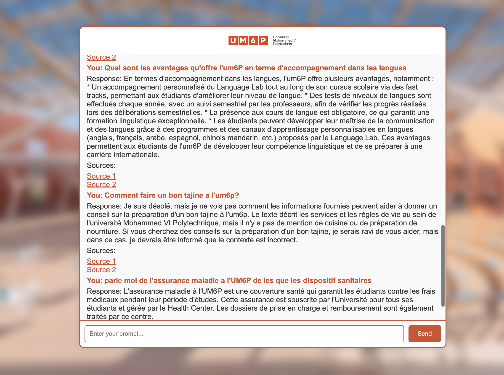

### Building a Retrieval-Augmented Generation ChatBot - Part II (Web Application)

In this second part of the project, we’ll focus on setting up a web application interface for the Retrieval-Augmented Generation (RAG) ChatBot. We'll create a UI for users to interact with the chatbot, process their requests, and receive responses based on the RAG system.

If you haven't read the [first part of this project](https://genereux-akotenou.github.io/blog/post/toward-rag-chatbot-part1), it's essential to understand the initial setup.

The complete project files are available on [GitHub](https://github.com/Genereux-akotenou/Rag-chatbot-beta).

## Folder Structure for Web Application

We add a new folder `DEV-UI` to the existing project structure, which will contain the static files for our web interface, HTML templates, and the main application code (`app.py`). The `docker-compose.yml` file is also included here to configure and run our chatbot service.

```diff
  ├─┬ DEV
    ├── 1_Data_Ingestion.ipynb
    ├── 2_Context_Retrieval.ipynb
    ├── database
    ├─┬ documents
    │ └── *.pdf(Folder to add new documents)
+   ├─┬ DEV-UI
+     ├── static
+     ├── templates
+     ├── app.py
+     └── docker-compose.yml
```

## Setting Up the Flask Application (app.py)

The Flask application consists of two main routes:

1. A route for serving the web page (index.html) as the UI.
2. An API route to process chat requests from the UI, sending user queries to the Llama model, which returns responses based on relevant context.
   
Here is the code for app.py:

we arr essentially two route in the app.py. one to deserve the web page ui and the second to sent a request for processing. 

We use Llama as LLM and start this using this this composer compose to start lamma using ollama. here is the content of our docker-compose file


```python
from flask import Flask, request, render_template, jsonify
from llama_index.core import QueryBundle
from llama_index.core.retrievers import BaseRetriever
from llama_index.vector_stores.postgres import PGVectorStore
from llama_index.core.schema import NodeWithScore
from typing import Any, List
from typing import Optional
import requests
import psycopg2
from llama_index.core.vector_stores import VectorStoreQuery
from llama_index.embeddings.huggingface import HuggingFaceEmbedding

# -----------------------------------------------------------------------
# APP
# -----------------------------------------------------------------------
app = Flask(__name__)

# -----------------------------------------------------------------------
# UTILS
# -----------------------------------------------------------------------
# DB Parameters
db_name = "rag_vector_db"
host = "localhost"
password = "rag_password"
port = "5433"
user = "rag_user"
vector_store = PGVectorStore.from_params(
    database=db_name,
    host=host,
    password=password,
    port=port,
    user=user,
    table_name="rag_paper_fr",
    embed_dim=1024,
)
embed_model = HuggingFaceEmbedding(model_name="manu/bge-m3-custom-fr")

# -----------------------------------------------------------------------
# ROUTES
# -----------------------------------------------------------------------
# Route for the main chat page
@app.route("/")
def home():
    return render_template("index.html")

# API route to handle chat requests
@app.route("/chat", methods=["POST"])
def chat():
    user_prompt = request.json.get("prompt", "")
    if not user_prompt:
        return jsonify({"response": "Please enter a prompt.", "sources": []})

    query_embedding = embed_model.get_query_embedding(user_prompt)
    query_mode = "default"
    vector_store_query = VectorStoreQuery(
        query_embedding=query_embedding, similarity_top_k=2, mode=query_mode
    )
    query_result = vector_store.query(vector_store_query)
    context = query_result.nodes[0].text + query_result.nodes[1].text
    print(context)
    
    url = 'http://localhost:11434/api/generate'
    base_file= "/TEXT-MINING/Project/"
    prompt_params = {
        "model": "llama3",
        "prompt": f"Generate a response to this question: '${user_prompt}' using only the information available here: context: '${context}'. The response should be in the prompt's language. If no response is in the context, please notify.",
        "stream": False
    }
    response = requests.post(url, json=prompt_params)
    if response.status_code == 200:
        response_data = response.json()
        return jsonify({
            "response": response_data.get("response", "No response received."),
            "sources": [base_file+query_result.nodes[0].metadata['file_path'], base_file+query_result.nodes[1].metadata['file_path']]
        })
    else:
        return jsonify({"response": f"Error: An error occurred!", "sources": []})
        
if __name__ == "__main__":
    app.run(debug=True)
```

## Configuring Docker-Compose for Llama Model
To run the chatbot, we need to set up Llama with Docker using docker-compose.yml. Here, we configure the Ollama image and map it to a port that allows us to send requests from our Flask app.

```yml
version: '3.8'

services:
  ollama:
    image: ollama/ollama
    container_name: ollama
    ports:
      - "11434:11434"
    volumes:
      - ollama:/root/.ollama
    restart: unless-stopped

volumes:
  ollama:
```

## Starting the Docker Service
Navigate to the DEV-UI folder and start the Docker service with the following command:

```batch
cd DEV-UI ;docker compose up -d
```

## User Interface Overview
Once the app and Docker container are running, you can access the chatbot interface in the browser. The interface provides a responsive chat environment, leveraging the RAG-powered backend to deliver accurate answers based on the embedded context.

Here's an example of the user interface:




<video width="600" controls>
  <source src="../../assets/images/RAG/demo.mp4" type="video/mp4">
  Your browser does not support the video tag.
</video>
