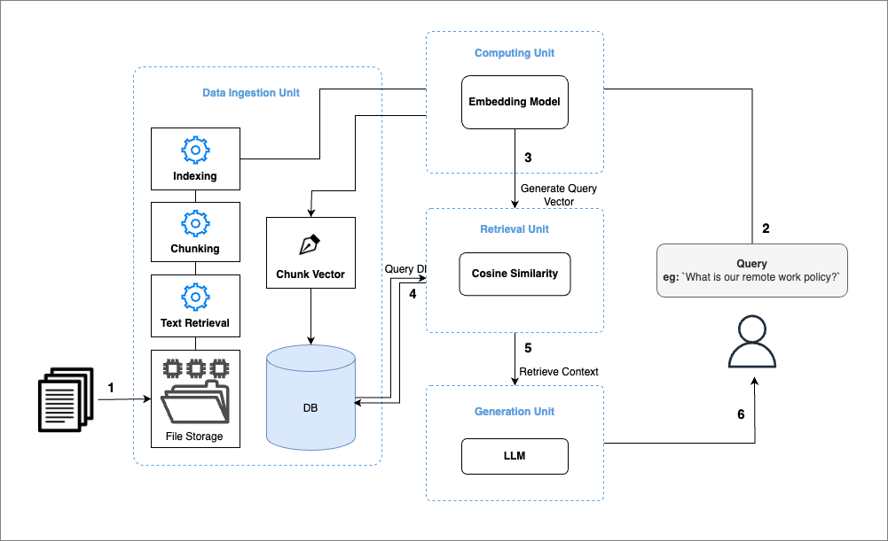
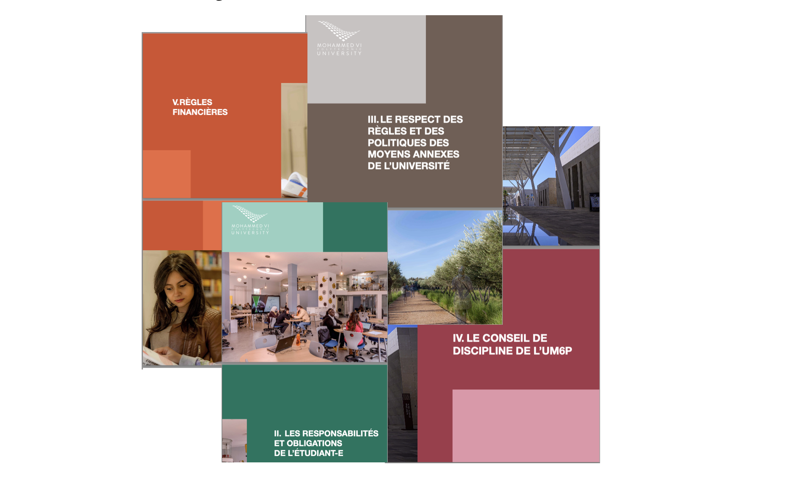

<!-- # Building a Retrieval-Augmented Generation (RAG) ChatBot -->

**Retrieval-Augmented Generation (RAG) bridges the gap between general and specific data understanding, enabling Large Language Models (LLMs) to generate accurate, data-specific responses.**

## Introduction to RAG
Large Language Models (LLMs) excel at reasoning with general data, but their performance diminishes when tasked with specific data, particularly when that data was generated after their training. To create applications that can comprehend private information or details beyond the model's existing knowledge, it is essential to enrich the model's understanding with specific information. This process of retrieving relevant information and integrating it into the model to generate accurate responses for particular datasets is referred to as Retrieval Augmented Generation (RAG).

In short points: 
- **General vs. Specific Data**: LLMs, like GPT models, excel at reasoning over general data but often falter with domain-specific or recently updated information.
- **Challenge**: LLMs cannot natively process new information that arises post-training.
- **Solution**: RAG provides a framework for retrieving relevant data from external sources and augmenting LLM outputs. This hybrid approach ensures responses are both data-rich and contextually accurate.

### RAG Workflow
The RAG architecture involves:
- **Data Ingestion**: Collecting, chunking, and embedding data for efficient retrieval.
- **Retrieval Process**: Using embeddings to fetch the most relevant pieces of information.
- **Generation**: Combining retrieved data with the LLM for response generation.

  
**Image 1: RAG Workflow Illustration**

### Objectives
  

The main goal of this paper is to develop a RAG-powered ChatBot following the architecture proposed in <a href="#image-1">Image 1</a> that assists students by providing easily accessible and up-to-date information about university regulations. We will build the chatbot using the Llama3 model. To enable this model to work on private documents and deliver accurate results, we will carefully select and build a more precise context for the LLM using RAG.

### Data Ingestion Pipeline
This section outlines the development of the Data Ingestion pipeline, which forms the first component of our architecture (see Image 1). We begin by implementing a Python script to orchestrate the data ingestion process and later automate this workflow using tools like Apache Airflow. Here is a breakdown of our objectives and the steps involved:

---
#####  Objectives
- Build a Data Ingestion pipeline to process new documents.
- Automate the detection and processing of documents using Apache Airflow.
- Extract text from various document formats and convert them into manageable chunks.
- Index these chunks and generate embedding vectors to store in a database.

#####  Setup
Let's install and import utils

